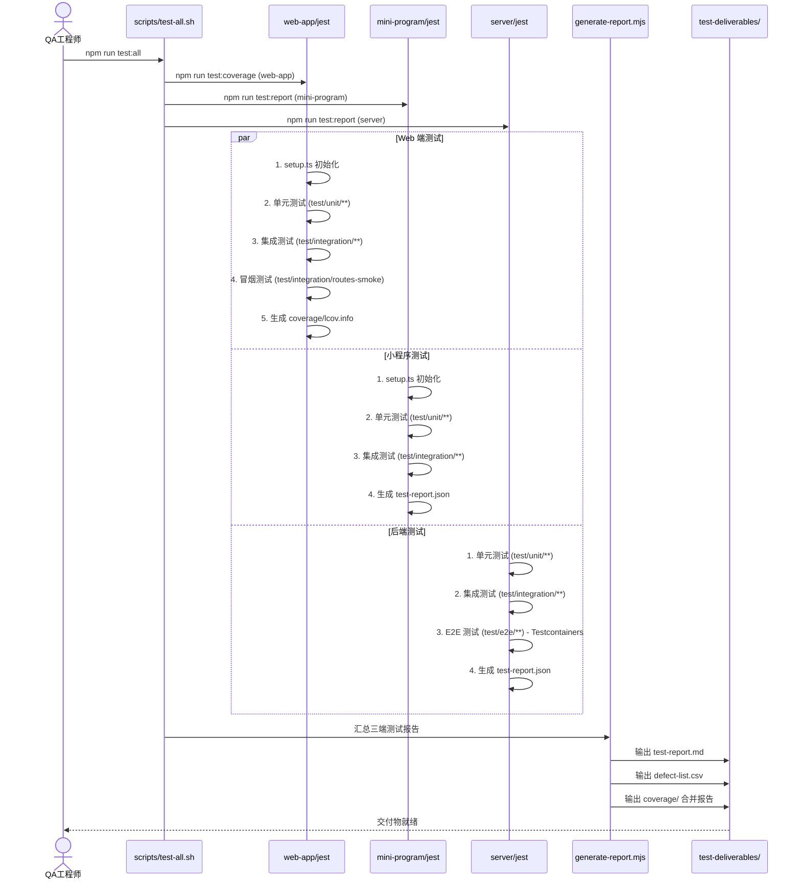
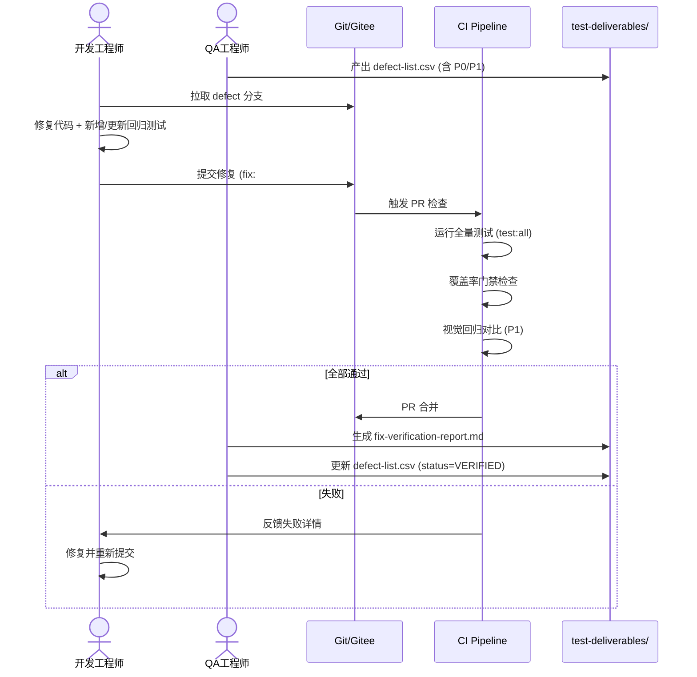
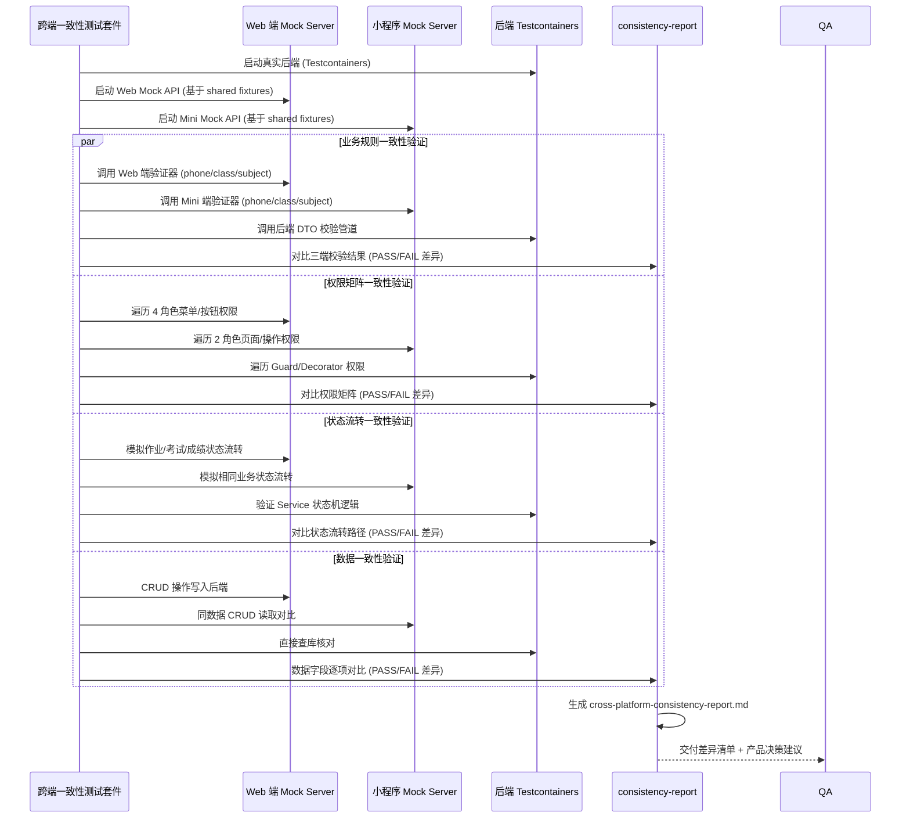
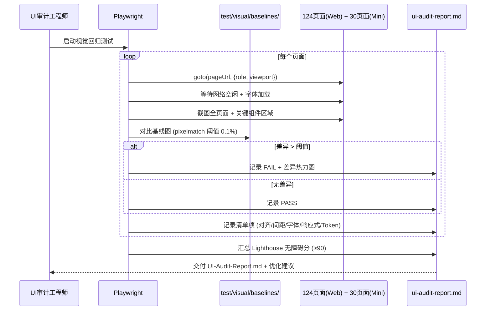
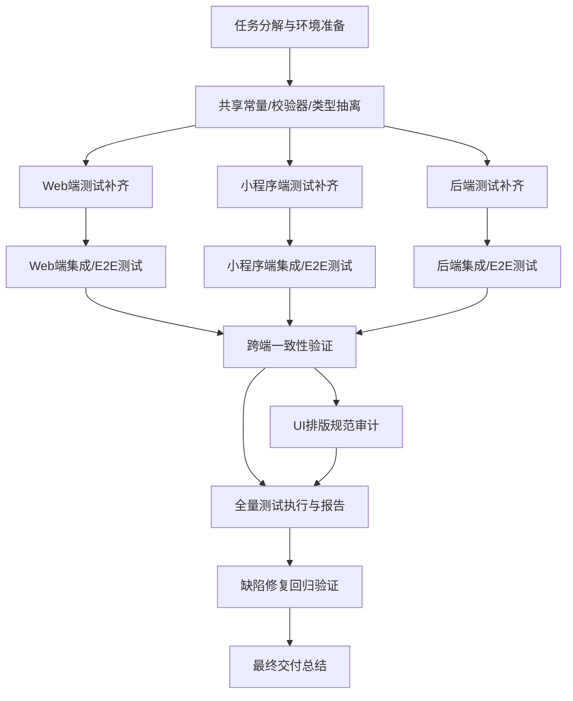

# 园丁工作台全面质量审计 - 系统架构设计与任务分解

> 版本：v1.0 | 日期：2026-07-26 | 架构师：高见远（Gao） | 基于 PRD：Audit-PRD.md

---

## 1. 实现方案 + 框架选型确认

### 1.1 技术栈复用策略（零新增重型框架）

| 端侧 | 现有栈 | 复用决策 | 备注 |
|------|--------|----------|------|
| **Web 端** | Vite + Vue 3 + TS + Pinia + Vue Router + Tailwind + MUI | ✅ 复用现有 Jest + Vue Test Utils + jsdom | 235 用例全通过，覆盖率 ~67% |
| **小程序端** | uni-app + Vue 3 + TS | ✅ 复用现有 Jest + @vue/test-utils + jsdom | 已有 validators/store/toolbox 单测，需补齐核心业务流 |
| **后端服务** | NestJS + TypeORM + MySQL + Redis | ✅ 复用现有 Jest + @nestjs/testing + Supertest | 已有 DTO/租户隔离/异常过滤器测试，需补 Controller/Service 集成测试 |

**核心原则**：不引入新测试框架，深化现有基建；仅补齐缺口（E2E、契约、视觉回归为 P2 后续）。

### 1.2 测试框架选型确认

| 层级 | 框架 | 适用范围 | 现状 |
|------|------|----------|------|
| **单元/组件** | Jest 29 + ts-jest | 全三端 | ✅ 就绪 |
| **Vue 组件** | @vue/test-utils v2 + vue3-jest (web) / ts-jest (mini) | Web、小程序组件 | ✅ 就绪 |
| **后端集成** | @nestjs/testing + Supertest | Controller/Service/E2E | ✅ 就绪 |
| **E2E（P2）** | Playwright | 跨端关键路径 | ⏳ P2 规划 |
| **契约测试（P2）** | Pact | API 契约 | ⏳ P2 规划 |
| **视觉回归（P1 建议）** | Playwright + pixelmatch | 关键页面快照 | ⏳ P1 建议 |

### 1.3 测试环境隔离策略（解决 PRD Q1-Q3）

| 问题 | 解决方案 | 实现位置 |
|------|----------|----------|
| **Q1 后端 DB 依赖** | Testcontainers (MySQL/Redis) 或 SQLite 内存库 + TypeORM `:memory:` | `server/test/setup-e2e.ts` 新增 |
| **Q2 小程序 Jest 兼容** | 现有 `ts-jest + allowJs: true` 已可编译 `.vue`/`.js`；补充 `@vue/test-utils` mount 适配 | `mini-program/jest.config.js` 微调 |
| **Q3 Canvas 小游戏冒烟** | `test/setup.ts` 已有 Proxy stub；冒烟仅挂载不渲染，断言 `mount` 不抛错 | 现有 `web-app/test/setup.ts` 已就绪 |

---

## 2. 文件列表及相对路径

### 2.1 新增/修改的测试文件树

```
work-system/
├── Architecture-Design.md              ← 本文档（新增）
├── web-app/
│   ├── test/
│   │   ├── unit/
│   │   │   ├── validators.spec.ts              ← 新增：Web 端 validators 单测（与 mini 端对齐）
│   │   │   ├── class-naming.spec.ts            ← 新增：班级命名规则单测
│   │   │   ├── phone-validator.spec.ts         ← 新增：手机号校验单测（跨端一致性）
│   │   │   └── subject-schema.spec.ts          ← 新增：学科模型单测（跨端一致性）
│   │   ├── integration/
│   │   │   ├── login-flow.spec.ts              ← 新增：登录全流程集成测
│   │   │   ├── crud-flow.spec.ts               ← 新增：CRUD 标准流程集成测
│   │   │   ├── ai-tool-flow.spec.ts            ← 新增：AI 工具调用流程集成测
│   │   │   └── photo-album-flow.spec.ts        ← 新增：相册 CRUD 流程集成测
│   │   ├── e2e/                                ← P1：核心路径 E2E（Playwright）
│   │   │   ├── teacher-homework-flow.spec.ts
│   │   │   ├── parent-check-grade.spec.ts
│   │   │   └── school-admin-manage.spec.ts
│   │   ├── visual/                             ← P1：视觉回归基线
│   │   │   ├── baselines/                      ← 基线截图目录
│   │   │   └── regression.spec.ts
│   │   ├── data/
│   │   │   ├── fixtures-extended.ts            ← 扩充：异常/边界/跨端对齐数据
│   │   │   └── cross-platform-fixtures.ts      ← 新增：跨端一致性测试数据
│   │   ├── helpers/
│   │   │   ├── assertions.ts                   ← 新增：断言封装库
│   │   │   ├── mock-factory.ts                 ← 新增：Mock 工厂统一入口
│   │   │   └── test-utils.ts                   ← 扩充：通用工具
│   │   └── setup.ts                            ← 修改：补充跨端共享 Mock
│   └── jest.config.cjs                         ← 修改：覆盖率门槛提升至 P1 标准
│
├── mini-program/
│   ├── test/
│   │   ├── unit/
│   │   │   ├── validators.spec.ts              ← 现有（扩充：边界/异常用例）
│   │   │   ├── subject-schema.spec.ts          ← 现有（扩充：完整学科树校验）
│   │   │   ├── class-naming.spec.ts            ← 新增：班级命名规则
│   │   │   ├── phone-validator.spec.ts         ← 新增：手机号校验（跨端对齐）
│   │   │   ├── store.spec.ts                   ← 现有（扩充：状态流转完整覆盖）
│   │   │   ├── toolbox.spec.ts                 ← 现有（扩充：数学工具/单位换算全覆盖）
│   │   │   └── login.spec.ts                   ← 现有（扩充：家长/教师登录异常流）
│   │   ├── integration/
│   │   │   ├── teacher-homework-flow.spec.ts   ← 新增：教师布置/批改作业全链路
│   │   │   ├── parent-check-grade.spec.ts      ← 新增：家长查看成绩/作业全链路
│   │   │   └── ai-tool-flow.spec.ts            ← 新增：AI 工具调用全链路
│   │   ├── e2e/                                ← P1：小程序核心路径 E2E
│   │   │   └── core-flows.spec.ts
│   │   ├── data/
│   │   │   ├── fixtures-extended.ts            ← 扩充：与 Web 端对齐的测试数据
│   │   │   └── cross-platform-fixtures.ts      ← 新增：跨端一致性测试数据
│   │   ├── helpers/
│   │   │   ├── assertions.ts                   ← 新增：断言封装（与 Web 端对齐）
│   │   │   └── mock-factory.ts                 ← 新增：Mock 工厂
│   │   └── setup.ts                            ← 新增：小程序测试环境初始化
│   └── jest.config.js                          ← 修改：覆盖率门槛、testMatch 扩展
│
├── server/
│   ├── test/
│   │   ├── unit/
│   │   │   ├── dto-validation.spec.ts          ← 现有（扩充：全 DTO 覆盖）
│   │   │   ├── tenant-isolation.spec.ts        ← 现有（扩充：跨租户场景全覆盖）
│   │   │   ├── business-exception.spec.ts      ← 现有（扩充：全错误码覆盖）
│   │   │   ├── class-naming.validator.spec.ts  ← 新增：班级命名规则校验器
│   │   │   ├── phone.validator.spec.ts         ← 新增：手机号校验器（跨端一致）
│   │   │   └── subject.validator.spec.ts       ← 新增：学科校验器
│   │   ├── integration/
│   │   │   ├── auth.controller.spec.ts         ← 新增：认证 Controller 集成测
│   │   │   ├── class.controller.spec.ts        ← 新增：班级 CRUD Controller 测
│   │   │   ├── teacher.controller.spec.ts      ← 新增：教师管理 Controller 测
│   │   │   ├── student.controller.spec.ts      ← 新增：学生管理 Controller 测
│   │   │   ├── homework.controller.spec.ts     ← 新增：作业 Controller 测
│   │   │   ├── exam.controller.spec.ts         ← 新增：考试/成绩 Controller 测
│   │   │   ├── notice.controller.spec.ts       ← 新增：通知 Controller 测
│   │   │   ├── ai-tool.controller.spec.ts      ← 新增：AI 工具 Controller 测
│   │   │   └── parent.controller.spec.ts       ← 新增：家长端 Controller 测
│   │   ├── e2e/
│   │   │   ├── setup-e2e.ts                    ← 新增：Testcontainers/MySQL/Redis
│   │   │   ├── auth.e2e.spec.ts
│   │   │   ├── teacher-workflow.e2e.spec.ts
│   │   │   ├── parent-workflow.e2e.spec.ts
│   │   │   └── school-admin-workflow.e2e.spec.ts
│   │   ├── mocks/
│   │   │   ├── database.mock.ts                ← 新增：TypeORM 内存库 Mock
│   │   │   ├── redis.mock.ts                   ← 新增：Redis Mock
│   │   │   └── external-api.mock.ts            ← 新增：外部 API Mock（微信/AI）
│   │   └── jest.config.js                      ← 修改：集成/E2E 环境分离
│   └── package.json                            ← 修改：新增 test:integration、test:e2e 脚本
│
├── test-deliverables/                          ← 新增：测试交付物输出目录
│   ├── test-report.md                          ← 测试执行报告
│   ├── defect-list.csv                         ← 缺陷清单
│   ├── coverage/                               ← 覆盖率报告
│   │   ├── web-app/
│   │   ├── mini-program/
│   │   └── server/
│   ├── ui-audit-report.md                      ← UI 排版审计报告
│   ├── cross-platform-consistency-report.md    ← 跨端一致性报告
│   └── fix-verification-report.md              ← 修复验证报告
│
├── scripts/
│   ├── test-all.sh                             ← 新增：全量测试一键执行
│   ├── test-web.sh
│   ├── test-mini.sh
│   ├── test-server.sh
│   ├── generate-report.mjs                     ← 新增：汇总报告生成
│   └── lighthouse-smoke.mjs                    ← 现有（复用）
│
└── docs/
    ├── test-naming-convention.md               ← 新增：测试命名规范
    ├── mock-strategy.md                        ← 新增：Mock 策略文档
    ├── fixture-pattern.md                      ← 新增：数据制备模式
    └── assertion-library.md                    ← 新增：断言封装文档
```

### 2.2 共享常量/类型文件（跨端一致性基线）

| 文件 | 用途 | 现状 |
|------|------|------|
| `web-app/src/constants/subjects.ts` | 15 学科常量 | ✅ 存在 |
| `mini-program/src/common/subject-schema.js` | 学科工具/列表/工具映射 | ✅ 存在 |
| `web-app/src/utils/validators.ts` | Web 端校验器 | ✅ 存在 |
| `mini-program/src/common/validators.js` | 小程序端校验器 | ✅ 存在 |
| `web-app/src/types/user.ts` | 用户/角色类型 | ✅ 存在 |
| **新增** `shared/constants/index.ts` | **跨端共享常量单一源头** | 🆕 需创建 |
| **新增** `shared/validators/index.ts` | **跨端共享校验器单一源头** | 🆕 需创建 |
| **新增** `shared/types/index.ts` | **跨端共享类型定义单一源头** | 🆕 需创建 |

---

## 3. 数据结构和接口（类图）

### 3.1 测试用例数据模型

```mermaid
classDiagram
    class TestCase {
        +string id
        +string module
        +string feature
        +string title
        +TestPriority priority
        +TestType type
        +string[] preconditions
        +TestStep[] steps
        +ExpectedResult expected
        +TestData testData
        +string[] tags
        +string assignee
    }

    class TestStep {
        +number stepNo
        +string action
        +string input
        +string expected
    }

    class ExpectedResult {
        +boolean success
        +string expectedValue
        +string actualValue?
        +string errorCode?
        +Screenshot? screenshot
    }

    class TestData {
        +string fixtureName
        +Record<string, any> overrides
        +MockConfig[] mocks
    }

    class MockConfig {
        +string apiPath
        +string method
        +int statusCode
        +any responseBody
        +int delay?
    }

    enum TestPriority { P0, P1, P2, P3 }
    enum TestType { UNIT, INTEGRATION, E2E, VISUAL, CONTRACT, PERFORMANCE }

    TestCase "1" *-- "*" TestStep
    TestCase "1" --> "1" ExpectedResult
    TestCase "1" --> "1" TestData
    TestData "1" *-- "*" MockConfig
```

### 3.2 缺陷模型

```mermaid
classDiagram
    class Defect {
        +string id
        +string title
        +string description
        +DefectSeverity severity
        +DefectStatus status
        +string module
        +string platform
        +string[] affectedEndpoints
        +TestCase failedTestCase
        +string rootCause
        +string fixCommit?
        +DateTime createdAt
        +DateTime resolvedAt?
        +string assignee
        +DefectVerification verification
    }

    class DefectVerification {
        +boolean regressionPassed
        +string[] regressionTestIds
        +DateTime verifiedAt
        +string verifiedBy
    }

    enum DefectSeverity { P0_BLOCKER, P1_CRITICAL, P2_MAJOR, P3_MINOR, P4_COSMETIC }
    enum DefectStatus { OPEN, IN_PROGRESS, FIXED, VERIFIED, CLOSED, REJECTED, DEFERRED }

    Defect "1" --> "1" DefectVerification
```

### 3.3 UI 检查清单模型

```mermaid
classDiagram
    class UIAuditChecklist {
        +string pagePath
        +string role
        +UIRule[] rules
        +AuditResult result
    }

    class UIRule {
        +string id
        +UICategory category
        +string description
        +string selector
        +UIExpectation expectation
        +boolean isAutomated
    }

    class UIExpectation {
        +string property
        +string expectedValue
        +string actualValue?
        +Tolerance tolerance?
    }

    class Tolerance {
        +number pixels
        +number percentage
    }

    enum UICategory {
        ALIGNMENT, SPACING, RESPONSIVE, TYPOGRAPHY, 
        COLOR_TOKEN, COMPONENT_REUSE, ACCESSIBILITY,
        FOCUS_MANAGEMENT, ICON_CONSISTENCY
    }

    enum AuditResult { PASS, FAIL, PARTIAL, SKIPPED }

    UIAuditChecklist "1" *-- "*" UIRule
    UIRule "1" --> "1" UIExpectation
    UIExpectation "1" --> "0..1" Tolerance
```

### 3.4 跨端一致性验证模型

```mermaid
classDiagram
    class CrossPlatformConsistency {
        +string featureId
        +string featureName
        +Platform web
        +Platform miniProgram
        +Platform backend
        +ConsistencyResult result
        +Difference[] differences
    }

    class Platform {
        +string endpoint
        +string component
        +string storeAction
        +ValidationRule[] rules
    }

    class ValidationRule {
        +string ruleId
        +string description
        +string expectedBehavior
        +string actualBehaviorWeb?
        +string actualBehaviorMini?
        +string actualBehaviorBackend?
        +boolean aligned
    }

    class Difference {
        +string field
        +string webValue
        +string miniValue
        +string backendValue
        +DifferenceType type
        +string decision
    }

    enum DifferenceType { VALIDATION, PERMISSION, STATE_FLOW, UI_TEXT, API_CONTRACT, DATA_FORMAT }

    CrossPlatformConsistency "1" --> "1" Platform : web
    CrossPlatformConsistency "1" --> "1" Platform : miniProgram
    CrossPlatformConsistency "1" --> "1" Platform : backend
    CrossPlatformConsistency "1" *-- "*" Difference
    Platform "1" *-- "*" ValidationRule
```

---

## 4. 程序调用流程（时序图）

### 4.1 测试执行流程（全端统一）



### 4.2 缺陷修复回归流程



### 4.3 跨端一致性验证流程



### 4.4 UI 排版审计流程（P1）



---

## 5. 任务列表（核心交付物）

### 5.1 任务依赖图



### 5.2 详细任务清单（按实现顺序）

| TaskID | Title | Description | Assignee | Dependencies | EstHours | Deliverables |
|--------|-------|-------------|----------|--------------|----------|--------------|
| **T01** | **任务分解与环境准备** | 创建任务板、配置 CI 脚本、验证三端测试命令可跑通 | software-architect | - | 4 | `scripts/test-*.sh`, `Architecture-Design.md` |
| **T02** | **共享常量/校验器/类型抽离** | 建立 `shared/` 目录，提取 SUBJECT_OPTIONS、PHONE_RE、班级命名规则、用户类型定义为单一源头 | software-engineer | T01 | 8 | `shared/constants/index.ts`, `shared/validators/index.ts`, `shared/types/index.ts` |
| **T03** | **Web端单测补齐：Validators/ClassNaming/Subject** | 补充 validators、班级命名、学科模型单测，与 shared 对齐 | software-engineer | T02 | 8 | `web-app/test/unit/validators.spec.ts`, `class-naming.spec.ts`, `subject-schema.spec.ts` |
| **T04** | **Web端集成测试：登录/CRUD/AI工具/相册** | 4大核心流程集成测试，复用 fixtures + mock-factory | software-engineer | T03 | 12 | `web-app/test/integration/*.spec.ts` (4 files) |
| **T05** | **Web端 E2E 核心路径** | Playwright 覆盖教师布置作业、家长查成绩、校管管理班级 3 条关键路径 | software-qa-engineer | T03 | 16 | `web-app/test/e2e/*.spec.ts` (3 files) |
| **T06** | **Web端视觉回归基线建立** | 124 页面基线截图生成，配置 pixelmatch 阈值 | software-qa-engineer | T03 | 8 | `web-app/test/visual/baselines/`, `visual.config.ts` |
| **T07** | **小程序端单测补齐：核心业务流** | 补齐教师作业流、家长查看流、AI工具调用、登录异常流单测 | software-engineer | T02 | 16 | `mini-program/test/unit/*.spec.ts` (7 files 新增/扩充) |
| **T08** | **小程序端集成测试：核心业务链路** | 教师布置/批改作业、家长查成绩/作业、AI工具调用 3 条集成链路 | software-engineer | T07 | 12 | `mini-program/test/integration/*.spec.ts` (3 files) |
| **T09** | **小程序端 E2E 核心路径** | Playwright 覆盖教师端/家长端 2 条关键路径 | software-qa-engineer | T07 | 12 | `mini-program/test/e2e/core-flows.spec.ts` |
| **T10** | **后端单测补齐：全 DTO/Validator/Guard** | 覆盖全部 300+ DTO、班级命名/手机号/学科校验器、权限 Guard | software-engineer | T02 | 16 | `server/test/unit/*.spec.ts` (10+ files) |
| **T11** | **后端集成测试：Controller 全覆盖** | 9 大模块 Controller 集成测，Supertest + Testcontainers | software-engineer | T10 | 24 | `server/test/integration/*.spec.ts` (9 files) |
| **T12** | **后端 E2E：跨模块业务流** | 认证、教师工作流、家长工作流、校管工作流 4 条 E2E | software-qa-engineer | T11 | 16 | `server/test/e2e/*.e2e.spec.ts` (4 files) |
| **T13** | **跨端一致性验证套件** | 基于 shared fixtures，验证校验器/权限/状态机/数据四维一致性 | software-qa-engineer | T02, T06, T09, T12 | 16 | `test/cross-platform/*.spec.ts`, `cross-platform-consistency-report.md` |
| **T14** | **UI 排版规范全页面审计** | 124+30 页面清单核查 + 视觉回归 + Lighthouse Accessibility ≥90 | software-qa-engineer | T06 | 16 | `ui-audit-report.md`, 优化前后对比截图 |
| **T15** | **全量测试执行与结构化报告** | 一键跑通三端，生成测试报告、缺陷清单、覆盖率报告 | software-qa-engineer | T13, T14 | 8 | `test-deliverables/test-report.md`, `defect-list.csv`, `coverage/` |
| **T16** | **P0/P1 缺陷修复回归验证** | 按严重度修复，全量回归，产出验证报告 | software-engineer | T15 | 24 | `fix-verification-report.md`, 更新后的 `defect-list.csv` |
| **T17** | **最终交付总结** | 汇总所有交付物，产出 Final-Delivery-Summary.md | software-architect | T16 | 4 | `Final-Delivery-Summary.md` |

> **总计预估工时：204h（约 25.5 人天）**，可并行压缩至 12-14 天（3 人并行：Web/小程序/后端各 1 人 + QA 1 人）

### 5.3 任务分配矩阵

| 角色 | 主导任务 | 协助任务 |
|------|----------|----------|
| **software-architect** | T01, T17 | T02, T13 |
| **software-engineer (Web)** | T03, T04 | T02, T05, T06 |
| **software-engineer (Mini)** | T07, T08 | T02, T09 |
| **software-engineer (Server)** | T10, T11 | T02, T12 |
| **software-qa-engineer** | T05, T06, T09, T12, T13, T14, T15, T16 | 全程质量把关 |

---

## 6. 依赖包列表（新增 devDependencies）

### 6.1 Web 端 (web-app)

```json
{
  "devDependencies": {
    "@playwright/test": "^1.48.0",
    "pixelmatch": "^5.3.0",
    "pngjs": "^7.0.0",
    "@types/pngjs": "^6.0.4",
    "lighthouse": "^12.1.0",
    "playwright-lighthouse": "^0.5.0"
  }
}
```

### 6.2 小程序端 (mini-program)

```json
{
  "devDependencies": {
    "@playwright/test": "^1.48.0",
    "@vue/test-utils": "^2.4.11",
    "pixelmatch": "^5.3.0",
    "pngjs": "^7.0.0"
  }
}
```

### 6.3 后端服务 (server)

```json
{
  "devDependencies": {
    "@nestjs/testing": "^10.4.4",
    "supertest": "^7.2.2",
    "testcontainers": "^10.13.0",
    "@testcontainers/mysql": "^10.13.0",
    "@testcontainers/redis": "^10.13.0",
    "typeorm": "^0.3.20"
  }
}
```

### 6.4 共享依赖 (根目录或 shared 包)

```json
{
  "devDependencies": {
    "ts-jest": "^29.4.12",
    "jest": "^29.7.0",
    "@types/jest": "^29.5.14"
  }
}
```

---

## 7. 共享知识：跨文件约定

### 7.1 测试命名规范

| 类型 | 文件命名 | Describe/It 命名 | 示例 |
|------|----------|------------------|------|
| **单元测试** | `*.spec.ts` | `describe('模块名', () => { it('should 动作_条件_预期', () => {}) })` | `validators.spec.ts`: `it('should return true for valid phone 13812345678', ...)` |
| **集成测试** | `*.spec.ts` (在 integration/) | `describe('功能流程: 模块A→模块B', () => { it('完整流程_场景_预期', () => {}) })` | `login-flow.spec.ts`: `it('完整登录流程_教师角色_跳转Dashboard', ...)` |
| **E2E 测试** | `*.e2e.spec.ts` | `test('E2E: 用户故事ID_关键路径_预期', async ({page}) => {})` | `teacher-homework.e2e.spec.ts`: `test('E2E: US-03_教师布置作业_学生端可见', ...)` |
| **视觉回归** | `*.visual.spec.ts` | `test('Visual: 页面路径_视口_基线版本', async () => {})` | `dashboard.visual.spec.ts`: `test('Visual: /teacher/dashboard_desktop_v1', ...)` |
| **跨端一致性** | `*.consistency.spec.ts` | `describe('一致性: 规则ID', () => { test('Web/Mini/Backend 对齐_规则描述', () => {}) })` | `phone-validator.consistency.spec.ts`: `test('Web/Mini/Backend 对齐_手机号校验规则', ...)` |

### 7.2 数据制备模式

```typescript
// 统一模式：test/data/fixtures-extended.ts
export interface Fixture<T> {
  name: string
  data: T
  overrides?: Partial<T>
  metadata?: {
    role?: Role
    scenario?: 'normal' | 'edge' | 'error' | 'boundary'
    platform?: 'web' | 'mini' | 'backend' | 'shared'
  }
}

// 使用示例
const teacherFixtures: Fixture<Teacher>[] = [
  { name: 'teacher-normal', data: { ... }, metadata: { role: 'teacher', scenario: 'normal' } },
  { name: 'teacher-no-class', data: { ...classes: [] }, metadata: { role: 'teacher', scenario: 'edge' } },
  { name: 'teacher-disabled', data: { ...enabled: false }, metadata: { role: 'teacher', scenario: 'error' } },
]

// Mock 工厂统一入口：test/helpers/mock-factory.ts
export class MockFactory {
  static createApiMock<T>(fixture: Fixture<T>, override?: Partial<T>): MockConfig
  static createStoreMock<T>(fixture: Fixture<T>): PiniaStoreMock
  static createServiceMock<T>(fixture: Fixture<T>): ServiceMock
}
```

### 7.3 Mock 策略

| 层级 | 策略 | 实现 |
|------|------|------|
| **API 层** | MSW (Mock Service Worker) + 共享 fixtures | `test/helpers/msw-handlers.ts` 基于 fixtures 生成 |
| **Store/Pinia** | `@vue/test-utils` + `createTestingPinia` + fixture 初始化 | `test/helpers/store-factory.ts` |
| **后端 Service/Repository** | `@nestjs/testing` TestingModule + 内存仓库 | `test/mocks/database.mock.ts` 使用 `Repository` 替身 |
| **外部依赖** | 统一 Mock：微信 API、AI API、文件存储 | `test/mocks/external-api.mock.ts` |
| **Canvas/WebGL** | jsdom Proxy stub (已在 setup.ts 实现) | 复用现有方案 |

### 7.4 断言封装库

```typescript
// test/helpers/assertions.ts
export const Assertions = {
  // 通用
  toMatchFixture<T>(actual: T, fixtureName: string, override?: Partial<T>): void
  
  // UI 专用
  toHaveSpacing(element: HTMLElement, expected: SpacingToken): void
  toHaveAlignment(element: HTMLElement, axis: 'horizontal' | 'vertical', expected: Alignment): void
  toUseDesignToken(element: HTMLElement, property: string, tokenName: string): void
  toBeResponsive(element: HTMLElement, breakpoints: Breakpoint[]): void
  toMeetA11y(element: HTMLElement, level: 'AA' | 'AAA'): void
  
  // 跨端一致性
  toMatchCrossPlatform(webResult: any, miniResult: any, backendResult: any, rule: ValidationRule): void
  
  // 业务规则
  toPassPhoneValidation(phone: string, platform: 'web' | 'mini' | 'backend'): void
  toPassClassNaming(className: string, platform: 'web' | 'mini' | 'backend'): void
  toPassSubjectValidation(subject: string, platform: 'web' | 'mini' | 'backend'): void
  
  // 状态流转
  toFollowStateMachine(entity: any, expectedTransitions: StateTransition[]): void
}
```

---

## 8. 待明确事项（需主理人/产品经理确认）

| # | 事项 | 影响范围 | 建议方案 | 待决策人 |
|---|------|----------|----------|----------|
| **D01** | **后端测试数据库方案** | 后端集成/E2E 测试能否跑通 | 方案 A: Testcontainers (MySQL/Redis) - 推荐，真实环境<br>方案 B: SQLite `:memory:` + TypeORM - 轻量但有方言差异<br>方案 C: 共享测试库 + 事务回滚 - 需独立测试库 | 架构师/后端负责人 |
| **D02** | **小程序端 E2E 运行环境** | mini-program/test/e2e 能否在 CI 跑通 | 方案 A: 微信开发者工具 CLI + 模拟器 - 官方但慢<br>方案 B: Playwright + miniprogram-simulator - 社区方案<br>方案 C: 仅做单测+集成测，E2E 延后 P2 | 产品经理/小程序负责人 |
| **D03** | **视觉回归基线图来源** | UI 审计能否自动化 | 方案 A: 现有设计稿切图为基线 - 需设计配合<br>方案 B: 当前生产环境截图为基线 - 现状基线<br>方案 C: 首次跑测生成基线，后续对比 - 零成本启动 | UI/前端负责人 |
| **D04** | **缺陷等级 P0-P3 判定细则** | 缺陷分级统一标准 | 建议沿用 PRD 表 3 定义：P0=阻塞发布/数据丢失/安全；P1=核心功能异常；P2=非核心功能/体验；P3=UI/文案/建议 | QA负责人/产品经理 |
| **D05** | **跨端差异“产品决策记录”归档位置** | 一致性验证产出的差异项如何管理 | 建议：`docs/decisions/cross-platform-decisions.md` 记录每个差异的决策、责任人、时间 | 产品经理/架构师 |
| **D06** | **UI 排版检查：视觉回归 vs 人工清单** | P1-01 验收方式 | 建议：关键页面（登录、Dashboard、列表、详情、表单）视觉回归；其余页面清单人工核查 | 前端负责人/QA负责人 |
| **D07** | **测试覆盖率门槛最终值** | CI 门禁配置 | PRD 目标：Lines ≥70%、Branches ≥60%、Functions ≥65%<br>现状 Web: 67%/56%/60%/71%<br>建议分阶段：M1 达现状基线，M2 达 65/55/60/68，M3 达标 | 架构师/技术负责人 |
| **D08** | **共享常量包发布方式** | `shared/` 如何被三端消费 | 方案 A: Git Submodule / 工作区引用 - 简单<br>方案 B: 私有 npm 包 (`@gardener/shared`) - 规范但需发布流程<br>方案 C: `tsconfig paths` 直接引用源码 - 零配置 | 架构师/构建负责人 |

---

## 9. 里程碑交付时间表

| 里程碑 | 产出物 | 预估完成 | 责任人 |
|--------|--------|----------|--------|
| **M1** | Architecture-Design.md 评审通过、共享常量包就绪 | Day 1-2 | 架构师 |
| **M2** | Web/小程序/后端单测补齐完成、集成测试框架就绪 | Day 3-7 | 全体工程师 |
| **M3** | E2E 核心路径、视觉回归基线、跨端一致性套件就绪 | Day 8-11 | QA + 工程师 |
| **M4** | 全量测试执行、测试报告、缺陷清单、UI审计报告产出 | Day 12-13 | QA |
| **M5** | P0/P1 缺陷修复完成、回归验证通过 | Day 14-16 | 工程师 + QA |
| **M6** | 最终交付总结、所有交付物归档 | Day 17 | 架构师 |

---

## 10. 验收标准映射（回扣 PRD）

| PRD 验收标准 | 对应任务 | 验收方式 |
|-------------|----------|----------|
| P0-01 功能完整性核查 100% 覆盖 | T03-T12 | 测试报告矩阵对比页面/接口清单 |
| P0-02 两端功能对应性 100% 匹配 | T13 | cross-platform-consistency-report.md 映射表 |
| P0-03 操作流程一致性关键路径对齐 | T05, T09, T12, T13 | E2E 用例步骤序列对比 |
| P0-04 业务规则一致性差异为 0 | T13 | 验证器/权限/状态机三端对比结果全绿 |
| P0-05 数据一致性 CRUD 跨端对比通过 | T13 | 同一后端写入读取字段级对比 |
| P0-06 全量测试用例结构化可驱动自动化 | T03-T12 | Test-Cases-Full.md + JSON 格式用例 |
| P0-07 Jest+Supertest 执行结构化报告 | T15 | test-report.md + defect-list.csv |
| P0-08 P0 0遗留 P1 100%修复回归通过 | T16 | fix-verification-report.md |
| P1-01 UI 排版清单 100% 通过 | T14 | ui-audit-report.md 清单全绿 |
| P1-02 Lighthouse Accessibility ≥ 90 | T14 | Lighthouse 报告附件 |
| P1-03 性能基线达标或优化 | T15 | CWV 指标对比表 |
| P1-04 覆盖率门禁 Lines≥70%/Branches≥60%/Funcs≥65% | T15 | coverage/ 合并报告 |

---

*文档结束*