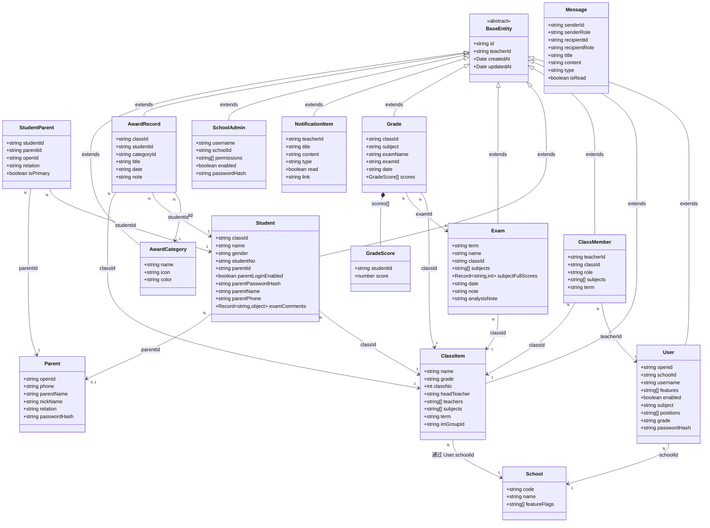
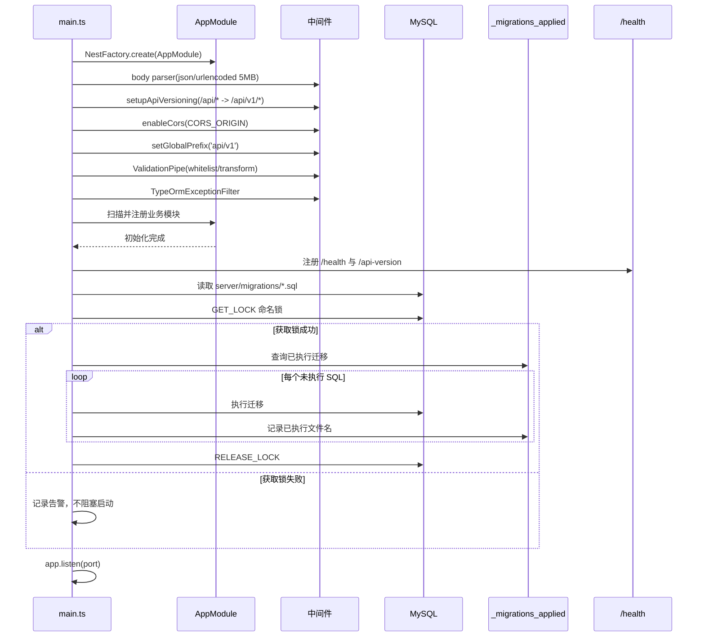
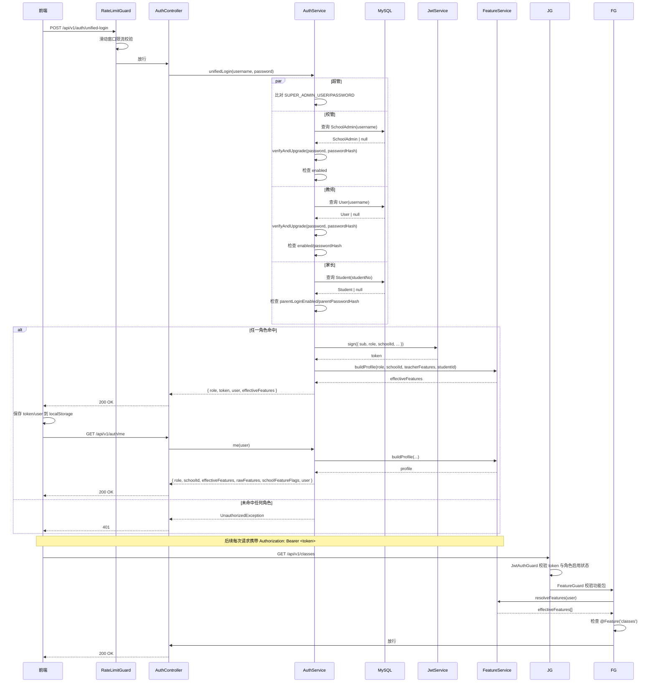

# Code Wiki - 园丁工作台（Gardener Work System）

## 1. 项目概览

园丁工作台（Gardener Work System）是一套面向中国中小学教师的教学生态管理平台，覆盖 PC 管理端、微信小程序、后端服务与共享类型包四端。

- **目标用户**：教师、班主任、学校管理员（校管）、超级管理员（超管）、家长。
- **核心场景**：班级管理、学生管理、考试与成绩分析、家校沟通、AI 备课与批卷、成长档案、资源库、办公工具、课堂互动。
- **仓库结构**：monorepo，包含 `web-app`、`server`、`mini-program`、`shared` 四个子项目。

```
work-system/
├── web-app/          # Vue 3 管理端（PC 浏览器）
├── server/           # NestJS 后端 API 服务
├── mini-program/     # uni-app 微信小程序
└── shared/           # 前后端共享的类型、常量、校验器
```

---

## 2. 整体技术栈

| 子项目 | 核心技术 | 说明 |
| --- | --- | --- |
| **server** | NestJS + TypeORM + MySQL 8.0 + JWT | 后端 RESTful API，负责鉴权、业务逻辑、数据持久化 |
| **web-app** | Vue 3.5 + TypeScript + Vite 6 + Pinia + Vue Router 4 + Tailwind CSS 3.4 | PC 管理端，面向教师/校管/超管/家长 |
| **mini-program** | uni-app（Vue 3）+微信小程序原生组件 | 移动端，面向教师/家长 |
| **shared** | TypeScript 类型与常量 | 前后端共享领域模型、校验规则、功能包 schema |

---

## 3. 后端架构（server）

### 3.1 模块职责总览

| 模块路径 | 职责 |
| --- | --- |
| `auth` | 微信登录、统一登录、Token 签发与校验 |
| `users` | 教师账号 CRUD（User 实体） |
| `parent-auth` | 家长登录认证（Parent 实体） |
| `admin` | 超级管理员账号 |
| `school-admin` | 学校管理员账号及权限（SchoolAdmin 实体） |
| `classes` | 班级基础信息（ClassItem 实体） |
| `class-members` | 教师-班级多对多关系（ClassMember，含班主任/科任角色） |
| `students` | 学生档案（Student 实体） |
| `student-parent` | 学生-家长关联 |
| `student-info-update` | 学生信息变更申请 |
| `seats` | 座位表 |
| `exams` | 考试管理（Exam 实体） |
| `grades` | 学生成绩（Grade 实体） |
| `analysis` | 学情分析/统计（学生趋势、班级趋势、强弱分析） |
| `textbook` | 教材与知识点 |
| `teaching-calendar` | 教学日历 |
| `messages` | 站内点对点消息（Message 实体） |
| `notification` | 通知（NotificationItem 实体） |
| `im` | 即时通讯（腾讯云 IM 集成） |
| `parent-contact` | 家长联系方式 |
| `my-gallery` / `gallery` | 个人相册 / 班级相册 |
| `ai` | AI 对话、文件解析、视觉/图像/视频生成 |
| `generated` | AI 生成内容（试卷、教案、知识点） |
| `chat-history` | AI 聊天历史与会话 |
| `class-ops` | 班级运营事件 |
| `duty-roster` | 值日表 |
| `award` | 表彰/奖励记录与分类 |
| `engagement` | 学生参与度 |
| `growth` | 成长记录 |
| `checkin` | 签到/打卡 |
| `game-scores` | 游戏化积分 |
| `evaluation` | 评价/排行榜 |
| `math-mistakes` | 数学错题本 |
| `reading-log` | 阅读日志 |
| `home-visit` | 家访 |
| `lesson-observation` | 听课观察 |
| `work-log` | 工作日志 |
| `notes` | 笔记 / 待办 |
| `audit` | 审计日志 |
| `backup` | 数据备份 |
| `monitor` | 监控日志 |
| `config` | AI 模型配置、平台配置（含密钥加密）、服务商管理 |
| `resource-library` / `online-resources` | 资源库与在线资源 |
| `security` | 安全相关 |
| `school` | 学校信息，并内含 `ScheduleItem`、`Attendance`、`Homework`、`Notice`、`Resource` 等班级数据实体 |
| `semester` | 学期管理 |

### 3.2 Common 基础设施层

| 路径 | 关键类/函数 | 职责 |
| --- | --- | --- |
| `common/entities/base.entity.ts` | `BaseEntity` | 所有业务实体的基类：`id`、`teacherId`、`createdAt`、`updatedAt` |
| `common/cache/cache.service.ts` | `CacheService` | 进程内 LRU 缓存（max 10000 条目 / 200MB，默认 TTL 5 分钟，支持按 `teacherId` 租户清理） |
| `common/crud/base.service.ts` | `BaseService` | 通用 CRUD 服务基类，默认按 `teacherId` 隔离；班级维度实体按班级集合过滤并校验 `ClassMember` 权限 |
| `common/crud/base.controller.ts` | `BaseController` | 通用 CRUD 控制器，自动注入 `teacherId`，支持 `classId/term/date` 过滤 |
| `common/guards/jwt-auth.guard.ts` | `JwtAuthGuard` | 统一 JWT 鉴权，校验 Bearer Token，按角色校验账号启用状态（teacher / school_admin / parent） |
| `common/guards/feature.guard.ts` | `FeatureGuard` | 功能包校验（需显式 `@UseGuards(JwtAuthGuard, FeatureGuard)`，管理端点不标 `@Feature`） |
| `common/filters/typeorm-exception.filter.ts` | `TypeOrmExceptionFilter` | 全局异常格式化，区分 `BusinessException` / `HttpException` / DB 错误 / 未预期异常 |
| `common/exceptions/business.exception.ts` | `BusinessException` | 带 `code` 的业务异常，默认 400 |
| `common/decorators/current-teacher.decorator.ts` | `@CurrentTeacher()` | 从 `req.user` 提取当前教师身份 |
| `common/decorators/roles.decorator.ts` | `@Roles(...)` | 标注所需角色（teacher / school_admin / parent / super） |
| `common/decorators/feature.decorator.ts` | `@Feature(...)` | 标注所需功能包 key |
| `common/constants/roles.ts` | `Roles` / `RoleValues` | 角色字符串常量 |
| `common/constants/tenant-tables.ts` | `TENANT_TABLES` | 按 `teacherId` / `classId` 级联清理的表清单 |
| `common/constants/global-school-id.ts` | `GLOBAL_SCHOOL_ID` | 全局学校 ID 常量 |

### 3.3 关键实体（Domain Entities）

| 实体路径 | 核心字段 | 说明 |
| --- | --- | --- |
| `users/user.entity.ts` | `openid`、`schoolId`、`username`、`features[]`、`enabled`、`subject`、`positions[]`、`grade` | 教师账号 |
| `schools/school.entity.ts` | `code`、`name`、`featureFlags[]` | 学校，学校级功能开关由超管配置 |
| `classes/class.entity.ts` | `name`、`grade`、`classNo`、`headTeacher`、`teachers[]`、`subjects[]`、`term`、`imGroupId` | 班级 |
| `class-members/class-member.entity.ts` | `teacherId`、`classId`、`role`、`subjects[]`、`term` | 教师-班级关系（班主任/科任） |
| `students/student.entity.ts` | `classId`、`name`、`gender`、`studentNo`、`parentId`、`parentLoginEnabled`、`examComments` | 学生档案 |
| `student-parent/student-parent.entity.ts` | `studentId`、`parentId`、`relation` | 学生-家长关联 |
| `exams/exam.entity.ts` | `term`、`name`、`classId`、`subjects[]`、`date`、`analysisNote`、`subjectFullScores` | 考试 |
| `grades/grade.entity.ts` | `classId`、`subject`、`examName`、`examId`、`scores: GradeScore[]` | 成绩（JSON 列存储学生分数） |
| `messages/message.entity.ts` | `senderId`、`recipientId`、`title`、`content`、`type`、`isRead` | 站内消息 |
| `notification/notification.entity.ts` | `teacherId`、`title`、`type`、`read`、`link` | 通知 |
| `school-admin/school-admin.entity.ts` | `username`、`schoolId`、`permissions[]`、`enabled` | 学校管理员 |
| `parent/parent.entity.ts` | `openId`、`phone`、`parentName`、`relation` | 家长 |
| `award/award.entity.ts` / `award-record` | 表彰分类与记录 | |
| `config/app-config.entity.ts` | `key`、`value`、`description` | 平台配置（K-V 存储） |
| `config/ai-settings.entity.ts` / `ai-provider.entity.ts` | `ownerType`、`ownerId`、`providerCode`、`baseUrl`、`apiKey`（加密） | AI 配置与服务商 |
| `chat-history/chat-session.entity.ts` | `sessionId`、`userId`、`messages[]` | AI 聊天历史 |

### 3.4 中间件与请求管道

请求进入顺序：

1. **Body Parser**：`json` / `urlencoded`（limit 5MB，适配 AI 大上下文）。
2. **API 版本化中间件**：`/api/*` → 307 临时重定向到 `/api/v1/*`（`/health` 与 `/api-docs` 排除）。
3. **CORS**：基于 `CORS_ORIGIN`，fail-closed（空值则关闭跨域）。
4. **全局 `ValidationPipe`**：`whitelist=true`、`transform=true`。
5. **全局 `TypeOrmExceptionFilter`**：统一异常响应格式。
6. **路由级守卫**：
   - `JwtAuthGuard`：认证 + 角色校验。
   - `FeatureGuard`：功能包校验（需显式启用）。
   - `ThrottlerGuard`：全局限流 60 次/分钟/IP（可 `@Throttle` 覆盖）。
   - `RateLimitGuard`：登录/注册等特定接口的内存滑动窗口限流。
7. **控制器 → 服务 → TypeORM**。
8. **异常出口**：统一由 `TypeOrmExceptionFilter` 捕获，返回 `{ statusCode, code, message }`。

### 3.5 启动流程

- **入口**：[main.ts](file:///d:/workspae/gitee/techer/work-system/server/src/main.ts)
- **配置**：[app.module.ts](file:///d:/workspae/gitee/techer/work-system/server/src/app.module.ts)
  - `ConfigModule.forRoot({ isGlobal: true, envFilePath: '.env' })`
  - `TypeOrmModule.forRootAsync`：MySQL、`utf8mb4`、时区 `+08:00`、`autoLoadEntities`、`connectionLimit=20`、`connectTimeout=5000`、可选 SSL、重试 3 次。
  - `JwtModule.registerAsync`：`secret`、`expiresIn=30d`。
  - `ThrottlerModule.forRootAsync`：`ttl=60000`、`limit=60`。
  - 全局 `APP_GUARD = ThrottlerGuard`。
- **Bootstrap 顺序**：
  1. `NestFactory.create(AppModule)`
  2. 配置 `json/urlencoded` body parser（5MB）。
  3. `setupApiVersioning`（在 `setGlobalPrefix` 之前注册，保证路径重写前能捕获 `/api/*`）。
  4. `enableCors`（基于 `CORS_ORIGIN`）。
  5. `setGlobalPrefix('api/v1')`。
  6. `ValidationPipe`（全局）。
  7. `TypeOrmExceptionFilter`（全局）。
  8. Swagger 文档（非生产环境默认开启，可用 `SWAGGER_ENABLED=true` 强制）。
  9. 静态资源托管：`web-app/dist`（管理端）、`public/h5`（小程序 H5）。
  10. **安全启动自检**：校验 `JWT_SECRET`、`SUPER_ADMIN_USER/PASSWORD`、`DB_SYNCHRONIZE`、`ENCRYPTION_KEY`。
  11. **数据库迁移**：
      - 读取 `server/migrations/*.sql`。
      - MySQL `GET_LOCK` 命名锁防止多实例并发执行迁移。
      - `_migrations_applied` 表记录已执行文件名，幂等可重复运行。
      - 失败不阻塞应用启动。
  12. 注册 `/health` 与 `/api-version` 端点。
  13. `app.listen(port, '0.0.0.0')`。

### 3.6 配置与密钥

- 环境变量文件：[server/.env.example](file:///d:/workspae/gitee/techer/work-system/server/.env.example)。
- 关键配置项：
  - `PORT`、`CORS_ORIGIN`
  - `DB_HOST`、`DB_PORT`、`DB_USERNAME`、`DB_PASSWORD`、`DB_DATABASE`、`DB_SSL`、`DB_SYNCHRONIZE`
  - `JWT_SECRET`、`JWT_EXPIRES_IN`
  - `SUPER_ADMIN_USER`、`SUPER_ADMIN_PASSWORD`
  - `WECHAT_APPID`、`WECHAT_SECRET`
  - `AI_BASE_URL`、`AI_API_KEY`、`AI_TEXT_MODEL`、`AI_VISION_MODEL`、`AI_TEMPERATURE` 等
  - `ENCRYPTION_KEY`：32 字节 hex，用于 `wxAppSecret`、`imSecretKey`、`aiApiKey` 的 AES-256-GCM 加密。
- 平台配置持久化：`app_config` 表，`ConfigService` 支持运行时读写与缓存（TTL 10 分钟）。

### 3.7 类图

#### 3.7.1 核心实体关系类图



#### 3.7.2 Service / Controller 继承关系类图

```mermaid
classDiagram
    direction TB

    class CrudService~T~ {
        <<abstract>>
        -Repository~T~ repo
        -ClassMemberService classMemberSvc
        +findAll(teacherId, classId, skip, take, term, date) Promise~{items, total}~
        +findOne(id, teacherId) Promise~T~
        +create(teacherId, dto) Promise~T~
        +update(id, teacherId, dto) Promise~T~
        +remove(id, teacherId) Promise~{id}~
        #isClassScopedEntity() boolean
        #classScopeField() string
    }

    class CrudController~T~ {
        <<abstract>>
        -CrudService~T~ service
        +create(dto, teacher) Promise~T~
        +findAll(teacher, classId, skip, take, term, date) Promise~{items, total}~
        +findOne(id, teacher) Promise~T~
        +update(id, dto, teacher) Promise~T~
        +remove(id, teacher) Promise~{id}~
    }

    class UsersService {
        +findAll(teacherId, classId, skip, take, term) Promise~{}
        +findOne(id, teacherId) Promise~User~
        +create(teacherId, dto) Promise~User~
        +update(id, teacherId, dto) Promise~User~
        +remove(id, teacherId) Promise~{id}~
    }

    class ClassesService {
        +findAll(teacherId, classId, skip, take, term) Promise~{}
        +findOne(id, teacherId) Promise~ClassItem~
        +create(teacherId, dto) Promise~ClassItem~
        +update(id, teacherId, dto) Promise~ClassItem~
        +remove(id, teacherId) Promise~{id}~
        +listMembers(classId, teacherId) Promise~[]~
        +addSubjectTeacher(classId, headTeacherId, body) Promise~{ok}~
        +removeSubjectTeacher(classId, headTeacherId, memberTeacherId) Promise~{ok}~
        +updateMySubjects(classId, teacherId, subjects) Promise~{ok}~
        +listSchoolTeachers(teacherId) Promise~[]~
        +updateMemberSubjects(classId, headTeacherId, memberTeacherId, subjects) Promise~{ok}~
        +getDashboard(classId, teacherId) Promise~object~
    }

    class StudentsService {
        +findAll(teacherId, classId, skip, take, term) Promise~{}
        +findOne(id, teacherId) Promise~Student~
        +create(teacherId, dto) Promise~Student~
        +update(id, teacherId, dto) Promise~Student~
        +remove(id, teacherId) Promise~{id}~
        +parseFile(filename, dataBase64) Promise~{rows, validCount, errorCount}~
        +importStudents(teacherId, classId, items) Promise~{count, ids}~
        +importAi(teacherId, mode, data, filename) Promise~{rows, validCount, errorCount}~
        +toggleParentLogin(user, studentId) Promise~{studentId, parentLoginEnabled}~
        +resetParentPassword(user, studentId, password) Promise~{studentId, ok}~
        +listParentBindings(teacherId, studentId) Promise~Binding[]~
        +unbindParent(teacherId, studentId, bindingId) Promise~{ok}~
        +setPrimaryParent(teacherId, studentId, bindingId) Promise~{ok}~
    }

    class ExamsService {
        +findAll(teacherId, classId, skip, take) Promise~{items, total}~
        +create(teacherId, dto) Promise~Exam~
        +remove(id, teacherId) Promise~{id}~
    }

    class GradesService {
        +findByExam(examId, teacherId) Promise~Grade[]~
        +upsertGrades(teacherId, input) Promise~Grade[]~
    }

    class AnalysisService {
        +studentTrend(studentId, classId, examId, examName, sortField, sortOrder) Promise~{labels, fields}~
        +classTrend(classId, examId, examName, sortField, sortOrder, subject) Promise~{labels, fields, examMeta}~
        +subjectStrength(classId, examId, examName, sortField, sortOrder, subject) Promise~{labels, data, classAvg}~
        +findByIdWithScores(id, classId) Promise~Grade~
        +findLatest(classId, teacherId) Promise~Grade~
        +deleteGrade(id, classId, teacherId) Promise~{id}~
    }

    class AuthService {
        +validateUser(phone, password) Promise~User~
        +login(phone, password) Promise~{access_token, user, role}~
        +validateToken(token) Promise~{sub, role, features, schoolId, schoolFeatureFlags}~
        +sendVerificationCode(phone) Promise~{mock, code}~
        +resetPassword(phone, code, newPassword) Promise~{success}~
    }

    class UsersController {
        +findAll(teacher, classId, skip, take, term) Promise~User[]~
        +findOne(id, teacher) Promise~User~
        +create(body, teacher) Promise~User~
        +update(id, body, teacher) Promise~User~
        +remove(id, teacher) Promise~{id}~
        +changePassword(body, req) Promise~{message}~
        +profile(req) Promise~User~
        +myClasses(req) Promise~ClassMember[]~
        +updateMe(req, body) Promise~User~
    }

    class ClassesController {
        +findAll(teacher, classId, skip, take, term, date) Promise~{items, total}~
        +findOne(id, teacher) Promise~ClassItem~
        +listMembers(id, teacher) Promise~[]~
        +listSchoolTeachers(teacher) Promise~[]~
        +addMember(id, body, teacher) Promise~{ok}~
        +removeMember(id, teacherId, teacher) Promise~{ok}~
        +updateMySubjects(id, body, teacher) Promise~{ok}~
        +updateMemberSubjects(id, teacherId, body, teacher) Promise~{ok}~
        +getDashboard(id, teacher) Promise~object~
    }

    class StudentsController {
        +findAll(teacher, classId, skip, take, term, date) Promise~{items, total}~
        +findOne(id, teacher) Promise~Student~
        +bulk(body, teacher) Promise~{count, ids}~
        +import(body, teacher) Promise~{count, ids}~
        +importAi(body, teacher) Promise~{rows, validCount, errorCount}~
        +toggleParentLogin(id, user) Promise~{studentId, parentLoginEnabled}~
        +resetParentPassword(id, body, user) Promise~{studentId, ok}~
        +listParentBindings(id, teacher) Promise~[]~
        +unbindParent(id, studentId, body, teacher) Promise~{ok}~
        +setPrimaryParent(id, studentId, body, teacher) Promise~{ok}~
    }

    class ExamsController {
        +findAll(teacher, classId, skip, take) Promise~{items, total}~
        +findOne(id, teacher) Promise~Exam~
        +create(dto, teacher) Promise~Exam~
        +update(id, dto, teacher) Promise~Exam~
        +remove(id, teacher) Promise~{id}~
        +analysis(id, teacher) Promise~Exam~
    }

    class GradesController {
        +findByExam(examId, teacher) Promise~Grade[]~
        +findById(id, teacher) Promise~Grade~
        +upsert(input, teacher) Promise~Grade[]~
    }

    class AnalysisController {
        +studentTrend(query, teacher) Promise~{labels, fields}~
        +classTrend(query, teacher) Promise~{labels, fields, examMeta}~
        +subjectStrength(query, teacher) Promise~{labels, data, classAvg}~
    }

    CrudService <|-- UsersService : extends
    CrudService <|-- ClassesService : extends
    CrudService <|-- StudentsService : extends
    CrudService <|-- ExamsService : extends
    CrudService <|-- GradesService : extends

    CrudController <|-- UsersController : extends
    CrudController <|-- ClassesController : extends
    CrudController <|-- StudentsController : extends
    CrudController <|-- ExamsController : extends
    CrudController <|-- GradesController : extends

    ClassesService --> ClassMemberService : classMemberSvc
    UsersService --> User : manages
    ClassesService --> ClassItem : manages
    StudentsService --> Student : manages
    ExamsService --> Exam : manages
    GradesService --> Grade : manages
    AnalysisService --> Grade : reads
    AuthService --> User : authenticates
    UsersController --> UsersService : uses
    ClassesController --> ClassesService : uses
    StudentsController --> StudentsService : uses
    ExamsController --> ExamsService : uses
    GradesController --> GradesService : uses
    AnalysisController --> AnalysisService : uses
```

#### 3.7.3 基础设施类职责关系类图

```mermaid
classDiagram
    direction TB

    class CacheService {
        -Map cacheStore
        -maxEntries
        -maxBytes
        +get(key) Promise~any~
        +set(key, value, ttlSec?) Promise~void~
        +del(key) Promise~void~
        +delByScope(scope) Promise~void~
        -normalize(obj) object
        -estimateBytes(obj) number
        -evictIfNeeded(extraBytes?)
        -isExpired(entry) boolean
    }

    class FeatureService {
        -ConfigService cfg
        -CacheService cache
        +resolveFeatures(user) Promise~string[]~
        -parseCsv(value) string[]
        -intersect(a, b) string[]
    }

    class JwtAuthGuard {
        -JwtService jwt
        -Reflector reflector
        -userRepo Repository~User~
        -saRepo Repository~SchoolAdmin~
        -studentRepo Repository~Student~
        +canActivate(context) Promise~boolean~
        -assertAccountActive(role, payload) Promise~void~
    }

    class FeatureGuard {
        -featureService FeatureService
        +canActivate(context) Promise~boolean~
    }

    class TypeOrmExceptionFilter {
        +catch(exception, host) Response~any~
    }

    class BusinessException {
        +string code
        +number statusCode
        +string message
    }

    class BaseEntity {
        <<abstract>>
        +string id
        +string teacherId
        +Date createdAt
        +Date updatedAt
    }

    JwtAuthGuard --> JwtService : uses
    JwtAuthGuard --> User : checks
    JwtAuthGuard --> SchoolAdmin : checks
    JwtAuthGuard --> Student : checks
    FeatureGuard --> FeatureService : uses
    FeatureService --> CacheService : uses
    CacheService --> "teacherId" : scoped by
    BaseEntity <|-- User : extends
    BaseEntity <|-- ClassItem : extends
    BaseEntity <|-- ClassMember : extends
    BaseEntity <|-- Student : extends
    BaseEntity <|-- Exam : extends
    BaseEntity <|-- Grade : extends
    BaseEntity <|-- NotificationItem : extends
    BaseEntity <|-- SchoolAdmin : extends
    BaseEntity <|-- AwardRecord : extends
    BaseEntity <|-- AwardCategory : extends
```

### 3.8 模块调用时序图

#### 3.8.1 启动与迁移时序



#### 3.8.2 登录鉴权时序



---

## 4. Web 管理端架构（web-app）

### 4.1 目录结构

```
web-app/
├── src/
│   ├── main.ts              # 入口
│   ├── App.vue              # 根组件
│   ├── router/index.ts      # 路由表
│   ├── layouts/             # 布局
│   │   ├── AppLayout.vue    # 主布局（侧边栏 + 顶栏 + 面包屑 + 内容区）
│   │   ├── BlankLayout.vue  # 空白布局（登录 / 403 / 404）
│   │   └── layoutMenus.ts   # 角色菜单配置
│   ├── stores/              # Pinia 状态
│   │   ├── auth-machine.ts  # 核心鉴权（基于 shared/auth/factory 状态机）
│   │   ├── prefs.ts         # 用户偏好（主题、密度、字体、强调色）
│   │   └── roleSwitch.ts    # 教师/家长双身份切换
│   ├── api/                 # HTTP 请求层
│   │   ├── request.ts       # Axios 实例（含 SWR 缓存、取消请求、401 跳转）
│   │   ├── auth.ts          # 登录/注册/当前用户
│   │   ├── teacher.ts       # 教师端最大 API 模块
│   │   ├── admin.ts / school-admin.ts / parent.ts
│   │   └── ...              # games、message、notification、chat 等
│   ├── views/               # 页面视图（按角色分目录）
│   ├── components/          # 共享组件（CrudTable、Modal、图表等）
│   ├── composables/         # 组合式函数
│   ├── utils/               # 工具函数（download、copyPrint、feedback、monitor）
│   └── directives/          # 自定义指令（v-lazy）
├── index.html
└── package.json
```

### 4.2 路由设计

- **模式**：`createWebHashHistory`（Hash 模式）。
- **核心路由**：
  - `/login`、`/forbidden`：公开路由，`BlankLayout`。
  - `/super`：超管工作台、学校管理、审计日志、平台配置、AI 服务商、功能包、成绩审计等。
  - `/school-admin`：校管工作台、教师/班级/学生管理、公告、教材、资源库、功能包开关、成绩查询、AI 配置等。
  - `/teacher`：教师工作台、班级与学生、学情与考试、学生评价、家校沟通、AI 与备课、教师办公、课堂工具（语文/数学/英语）、小游戏合集、Schema 驱动 CRUD。
  - `/parent`：家长中心、教材知识点、资源库、跨娃比对。
  - `/`：根路径根据当前角色重定向到对应工作台。
  - `/:pathMatch(.*)*`：404。
- **路由守卫**：未登录跳转登录、角色不匹配跳 403、功能包权限不足提示。
- **预加载**：鼠标悬停预加载目标路由组件；空闲时预加载常用路由。

### 4.3 状态管理

- **`stores/auth-machine.ts`**：核心鉴权状态机。
  - 状态：`token`、`user`、`role`、`isLoggedIn`、`effectiveFeatures`、`schoolFeatureFlags`。
  - 能力：多角色登录、登出、角色切换、功能包过滤、localStorage 持久化。
- **`stores/prefs.ts`**：用户偏好。
  - 主题、密度、侧边栏折叠、强调色、字体大小、最近考试记录。
  - 自动应用 DOM 样式（`.dark` 类、CSS 变量、`font-size`）。
- **`stores/roleSwitch.ts`**：教师/家长双身份切换。
  - 当用户同时拥有 `teacher` + `parent` 身份时存储双 token 和双 user，支持一键切换。

### 4.4 API 层

- **核心封装**：[request.ts](file:///d:/workspae/gitee/techer/work-system/web-app/src/api/request.ts)。
  - `baseURL` 解析优先级：运行时 `window.__APP_CONFIG__.API_BASE_URL` > `VITE_API_BASE` > `/api/v1`。
  - 请求拦截器：自动注入 `Authorization: Bearer <token>`，AbortController 取消重复请求。
  - 响应拦截器：自动解包 `res.data`，401 时清除登录态并跳转登录页。
  - 内置 SWR 缓存：5 秒内新鲜命中直接返回，30 秒内过期返回旧数据并后台刷新。
- **业务 API**：
  - `auth.ts`：多角色登录、统一登录、健康检查、当前用户。
  - `teacher.ts`：班级与学生、家校沟通、AI 工具、成绩分析、考试/成绩 CRUD、排行榜、通用 CRUD、学生批量导入等。
  - 其他：`admin.ts`、`school-admin.ts`、`parent.ts`、`games.ts`、`message.ts`、`notification.ts`、`chat.ts`、`feature.ts`、`textbook.ts`、`resource-library.ts` 等。

### 4.5 关键布局与组件

- **`AppLayout.vue`**：主布局容器，包含 `Sidebar`、`Navbar`、`Breadcrumb`、内容区；教师/超管/校管工作台支持二级菜单“瓷砖铺”。
- **`BlankLayout.vue`**：空白布局，用于登录、403、404。
- **`RouteOutlet.vue`**：纯 `<router-view />` 占位，作为各角色模块的父路由容器。
- **`SchemaCrudPage.vue`**：schema 驱动通用 CRUD，根据 `entity` props 和 `shared/schemas/crud-schema.ts` 自动生成列表和表单。
- **图表组件**：`SvgBarChart.vue`、`SvgLineChart.vue`、`SvgPieChart.vue`、`SvgRadarChart.vue`、`SvgProgress.vue`。

---

## 5. 小程序架构（mini-program）

### 5.1 页面结构

- **主包**：`pages/login`、`pages/parent-login`、`pages/dashboard`、`pages/classes`、`pages/students`、`pages/toolbox`、`pages/config`。
- **分包**（按业务域分包，减少主包体积）：
  - `pages/games`：30+ 款小游戏。
  - `pages/tools`：常用工具箱（随机选座、计时器、计算器、数学工具、随机抽签等）。
  - `pages/ai`：AI 助手、知识点生成、智能组卷、考试分析、互动答疑、智能教案。
  - `pages/teaching`：教学相关（数据看板、考试管理、成绩管理、座位表、排行榜、雷达图、考勤、作业、教学日历等）。
  - `pages/community`：社区相关（随机分组、课表、考勤、作业、公告、个人中心、资源库、成长档案、家长联系、教师通讯录、班级活动等）。
  - `pages/writing`：小作文助手、英语小故事、情景对话、教育论文、文案模板库、知识点库、通知模板等。
  - `pages/quick`：智能工具、学科练习。
  - `pages/subject-tools`：学科工具（语文、英语、数学、古诗词、单词卡片、听写、成语、阅读、语法、听力、拼音等）。
  - `pages/office-tools`：办公工具（翻译助手、教育论文、评语生成、期末总结、黑板报生成、演讲稿生成）。
  - `pages/school-admin`：学校管理、学校功能包。
  - `pages/parent`：家长中心、资源库、跨娃比对。
  - `pages/admin`：管理员面板。
  - `pages/crud`：通用 CRUD 管理。
  - `pages/ai-center`：AI 备课中心。

### 5.2 技术实现

- **框架**：uni-app（Vue 3 语法）。
- **状态与网络**：`common/store.js`（本地状态）、`common/request.js`（HTTP 封装）。
- **Mock**：`mock/` 目录提供开发期模拟数据。
- **分包加载**：`pages.json` 配置 `preloadRule`，提前加载高频分包。

---

## 6. 共享包（shared）

### 6.1 目录与职责

```
shared/
├── index.ts                  # 统一导出
├── auth/
│   ├── factory.ts            # 鉴权状态机工厂（多角色登录、token/user 管理）
│   └── types.ts              # 用户/登录相关类型
├── constants/
│   ├── features.ts           # 功能包 key 常量
│   ├── roles.ts              # 角色常量
│   └── subjects.ts           # 学科等常量
├── schemas/
│   └── crud-schema.ts        # Schema 驱动 CRUD 配置（字段、表单、搜索）
├── validators/
│   └── index.ts              # 通用校验器
└── types/
    └── index.ts              # 基础领域类型
```

### 6.2 关键导出

- **`auth/factory`**：状态机工厂，供 web-app 的 `auth-machine.ts` 和 mini-program 的 `common/auth-machine.js` 复用同一套登录/登出/角色切换逻辑。
- **`schemas/crud-schema.ts`**：通用 CRUD schema，驱动 `SchemaCrudPage.vue` 和 mini-program 的 `pages/crud/crud`。
- **`constants/features.ts`**：功能包 key 常量，server `FeatureService`、web-app 路由守卫、mini-program 权限判断共用同一套 key。

---

## 7. 依赖关系与数据流

```
                ┌──────────────┐
                │   Browser    │
                │  (web-app)   │
                └──────┬───────┘
                       │ REST /api/v1
                ┌──────▼───────┐
                │   NestJS     │
                │   Server     │
                └──────┬───────┘
                       │ TypeORM
                ┌──────▼───────┐
                │  MySQL 8.0   │
                └──────────────┘

                ┌──────────────┐
                │  WeChat MP   │
                │(mini-program)│
                └──────┬───────┘
                       │ REST /api/v1
                ┌──────▼───────┐
                │   NestJS     │
                │   Server     │
                └──────────────┘
```

- **server → external**：
  - 微信 API（内容安全、小程序登录）。
  - 腾讯云 IM（家校沟通，`imSdkAppId` + `imSecretKey` 生成 UserSig）。
  - AI 大模型提供商（通义千问 / OpenAI 兼容接口，由 `config/ai-provider.entity.ts` 配置多服务商）。
- **web-app → shared**：web-app 直接引用 `shared` 的类型、常量、schema。
- **mini-program → shared**：mini-program 的 `common/` 层复用 `shared` 的设计理念，但编译为 JS。

---

## 8. 项目运行方式

### 8.1 环境要求

- **Node.js**：>= 18.x
- **包管理**：各子项目独立使用 `npm`
- **数据库**：MySQL 8.0（腾讯云数据库 MySQL / TencentDB for MySQL 或本地实例）
- **浏览器**：Chrome / Edge / Firefox（web-app 管理端）

### 8.2 环境变量

- 后端环境变量模板：[server/.env.example](file:///d:/workspae/gitee/techer/work-system/server/.env.example)
- 关键变量：
  - `PORT`、`CORS_ORIGIN`
  - `DB_HOST`、`DB_PORT`、`DB_USERNAME`、`DB_PASSWORD`、`DB_DATABASE`、`DB_SSL`
  - `JWT_SECRET`、`JWT_EXPIRES_IN`
  - `SUPER_ADMIN_USER`、`SUPER_ADMIN_PASSWORD`（生产必须为 bcrypt 哈希）
  - `WECHAT_APPID`、`WECHAT_SECRET`
  - `AI_BASE_URL`、`AI_API_KEY`、`AI_TEXT_MODEL`、`AI_VISION_MODEL`
  - `ENCRYPTION_KEY`（32 字节 hex，生产必填）
  - `LOGIN_CODE`（生产必须强随机值，dev 允许弱默认值）
  - `DB_SYNCHRONIZE`（生产必须 `false`，依赖 migration）

### 8.3 本地启动步骤

**后端**

```bash
cd server
npm install
cp .env.example .env
# 编辑 .env 填入数据库、JWT、微信、AI 等配置
npm run start:dev
```

- 默认监听 `0.0.0.0:3000`。
- Swagger 文档：非生产环境访问 `/api-docs`。
- 健康检查：`GET /health`。

**Web 管理端**

```bash
cd web-app
npm install
npm run dev
```

- 开发服务器默认运行在 `http://localhost:5202`。
- 生产构建：`npm run build`，产物输出到 `web-app/dist`。

**微信小程序**

- 使用微信开发者工具打开 `mini-program` 目录。
- 真机预览需在微信公众平台配置服务器域名白名单。

### 8.4 Docker / 本地数据库（可选）

- 后端提供 `docker-compose.local.yml`（用于本地联调 MySQL 容器）。
- 当 `DB_HOST=127.0.0.1` 时可直接连接本地容器数据库。

---

## 9. 关键类与函数速查

### 9.1 Server 关键 Service

| 类路径 | 关键方法 | 说明 |
| --- | --- | --- |
| `server/src/auth/auth.service.ts` | `validateUser`、`login`、`validateToken` | 教师/校管登录鉴权 |
| `server/src/users/users.service.ts` | `create`、`findAll`、`findOne`、`update`、`remove` | 教师账号管理 |
| `server/src/classes/classes.service.ts` | `create`、`findAll`、`findOne`、`update`、`remove` | 班级管理 |
| `server/src/students/students.service.ts` | `create`、`findAll`、`findOne`、`update`、`remove` | 学生档案管理 |
| `server/src/exams/exams.service.ts` | `create`、`findAll`、`findOne`、`update`、`remove` | 考试管理 |
| `server/src/grades/grades.service.ts` | `upsertGrades`、`findGrades` | 成绩录入与查询 |
| `server/src/analysis/analysis.service.ts` | `studentTrend`、`classTrend`、`subjectStrength` | 学情分析聚合查询 |
| `server/src/ai/ai.service.ts` | `chat`、`chatStream`、`generateImage`、`generateVideo`、`analyzeImage` | AI 对话与多模态能力 |
| `server/src/config/config.service.ts` | `listAppConfig`、`getAppConfigValue`、`setAppConfig`、`saveAppConfig`、`publicConfig`、`getAiSettings`、`saveAiSettings`、`listProviderModels` | 平台配置、AI 配置、服务商模型查询 |
| `server/src/common/cache/cache.service.ts` | `get`、`set`、`del`、`delByScope` | 进程内缓存 |
| `server/src/common/crud/base.service.ts` | `findAllWithFilters`、`findOneWithAccessCheck`、`create`、`update`、`remove` | 通用 CRUD 基类 |

### 9.2 Web 端关键 Composables / Utils

| 路径 | 关键导出 | 说明 |
| --- | --- | --- |
| `web-app/src/api/request.ts` | `request`、`get`、`post`、`put`、`del`、`cachedGet` | Axios 封装，含 SWR 缓存与取消请求 |
| `web-app/src/stores/auth-machine.ts` | `useAuthStore` | 核心鉴权 store |
| `web-app/src/stores/prefs.ts` | `usePrefsStore` | 偏好设置 store |
| `web-app/src/stores/roleSwitch.ts` | `useRoleSwitchStore` | 双角色切换 store |

---

## 10. 部署与运维要点

- **反向代理**：Nginx 可配置为：
  - `/api/v1/` → 转发到 NestJS `3000` 端口。
  - `/` → 托管 `web-app/dist`。
  - `/h5/` → 托管 `public/h5`（小程序 H5 壳）。
- **Swagger**：生产环境默认关闭，可通过 `SWAGGER_ENABLED=true` 临时开启。
- **数据库迁移**：`server/migrations/*.sql`，启动时通过命名锁自动执行幂等迁移，失败不阻塞启动。
- **安全启动自检**：
  - `JWT_SECRET` 为弱默认值时拒绝启动。
  - 生产环境 `SUPER_ADMIN_PASSWORD` 必须为 bcrypt 哈希格式。
  - 生产环境 `LOGIN_CODE` 未配置时拒绝启动。
  - 生产环境 `DB_SYNCHRONIZE=true` 时告警。
  - `ENCRYPTION_KEY` 未配置时告警，密钥类配置将以明文落库。

---

## 11. 贡献与开发规范（简述）

- 后端遵循 NestJS 规范：模块化、依赖注入、装饰器声明路由与守卫。
- 前端遵循 Vue 3 Composition API + `<script setup lang="ts">`。
- 通用列表/表单优先使用 `SchemaCrudPage` + `shared/schemas/crud-schema.ts`。
- 新增功能包需同步更新 `shared/constants/features.ts`、server `FeatureService`、web-app `layoutMenus.ts`。
