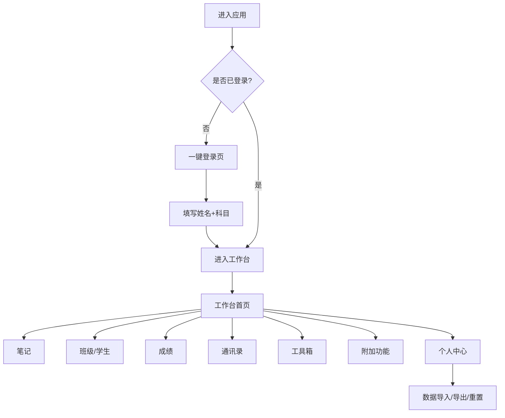

# 教师专用工作台 - 产品需求文档 (PRD)

## 1. 产品概述

「园丁工作台」是一款面向教师的一站式教学管理 Web 应用，整合学生、班级、成绩、笔记、通讯录、工具箱等日常高频场景，通过一键登录 + 本地数据持久化，让老师开箱即用。

- 主要用途：解决小学教师在备课、班级管理、学生评价、家校沟通等场景中工具分散、效率低的问题。
- 目标用户：公办/民办小学的全科或主科教师、班主任、年级组长。
- 目标价值：免登录、轻量、界面友好、工具齐全，提升教学管理效率 50% 以上。

## 2. 核心功能

### 2.1 用户角色
| 角色 | 注册方式 | 核心权限 |
|------|----------|----------|
| 教师用户 | 首次进入填写姓名+任教科目即可「一键登录」 | 全部模块读写，可重置本地数据 |

> 系统采用本地浏览器存储（localStorage）作为数据层，无后端依赖，便于演示与本地使用。

### 2.2 功能模块

1. **一键登录 / 个人中心**：首次进入设置姓名+科目即可使用；个人中心展示头像、统计、主题切换、数据导入导出。
2. **工作台首页 (Dashboard)**：今日课表、待办、班级速览、最近笔记、工具快捷入口。
3. **笔记模块**：分类管理（教学反思/班会记录/学习资料/其他）、富文本编辑、搜索、置顶、收藏。
4. **班级管理**：创建/编辑班级、班主任与任课教师、班级人数、班级口号、班级相册。
5. **学生管理**：按班级查看学生档案（姓名、性别、学号、家长联系方式、座位号、备注），支持新增/编辑/删除/批量导入。
6. **成绩管理**：按班级+科目+考试录入成绩，自动计算平均分/最高分/及格率/优秀率；图表展示。
7. **教师通讯录**：按学科/年级/办公室分组，可快速拨打电话（tel:）与复制邮箱。
8. **常用工具箱**：
   - 随机点名（带动画与历史记录）
   - 倒计时 / 计时器
   - 课堂计算器
   - 评语生成器（按学生特点生成评语模板）
   - 口算题生成器（加减乘除）
   - 课程表生成（自定义课表）
   - 颜色取色器
9. **附加功能**：
   - 课表管理（按周展示）
   - 考勤管理（每节/每日打卡）
   - 作业登记（布置/批改状态）
   - 班级公告（发布/置顶）
   - 教学资源库（链接/分类）
   - 数据统计报表

### 2.3 页面详情
| 页面名称 | 模块名称 | 功能描述 |
|----------|----------|----------|
| 登录页 | 一键登录 | 输入姓名+任教学科，提交后进入工作台 |
| 工作台 | 顶部欢迎、统计卡片、今日课表、最近笔记、快捷工具 | 总览老师一天的工作 |
| 笔记 | 笔记列表、编辑/分类、搜索/置顶 | 分类管理所有教学笔记 |
| 班级管理 | 班级列表、班级详情、相册 | 维护班级基本信息 |
| 学生管理 | 学生列表、学生档案 | 按班级组织学生数据 |
| 成绩管理 | 录入成绩、统计报表 | 录入并可视化成绩 |
| 通讯录 | 教师列表、搜索/筛选 | 查找校内同事 |
| 工具箱 | 工具卡片网格 | 集中进入 7+ 教学小工具 |
| 课表 | 周视图课表 | 查看一周课程 |
| 考勤 | 班级考勤表 | 标记出勤情况 |
| 作业 | 作业列表 | 登记与跟踪 |
| 公告 | 公告列表 | 班级/全校通知 |
| 资源库 | 资源列表 | 收藏教学链接 |
| 个人中心 | 资料、主题、数据管理 | 设置与数据导入导出 |

## 3. 核心流程

## 4. 用户界面设计

### 4.1 设计风格

- **设计语言**：温暖、教育、有童趣但不幼稚；走「奶油马卡龙 + 圆润卡片 + 柔和阴影」路线。
- **主色板**：
  - 主色：奶油黄 `#FFD479`（温暖、亲和）
  - 辅色：薄荷绿 `#7FD8A4`、樱花粉 `#FF9EB5`、天蓝 `#7BC6FF`
  - 文字：`#3D2E1F`（深棕）、`#7A6A55`（次级）
  - 背景：`#FFF9EE`（米白底）+ 噪点纹理
- **字体**：
  - 中文标题：「ZCOOL KuaiLe」「Ma Shan Zheng」（手写感）
  - 中文正文：「Noto Sans SC」
  - 数字/英文：「Caveat」「Nunito」
- **圆角与阴影**：圆角 `16~24px`，阴影柔和 `0 8px 24px rgba(190,140,80,.10)`
- **布局**：左侧可折叠侧边栏 + 顶部面包屑 + 内容卡片；桌面优先。
- **图标**：使用 lucide 图标库 + 少量 emoji 装饰（🍎📚✏️ 等）。
- **微动效**：进入页面渐显，悬停卡片上浮，工具箱卡片点击波纹。

### 4.2 页面设计概览
| 页面 | 模块 | UI 元素 |
|------|------|---------|
| 登录 | 一键登录卡 | 居中卡片，圆形头像预览，输入框圆角+米黄色，登录按钮渐变 |
| 工作台 | 统计卡 | 4 张统计卡 + 渐变背景 |
| 工作台 | 今日课表 | 时间轴样式 |
| 笔记 | 列表 | 双列卡片，分类色标 |
| 学生管理 | 列表 | 表格 + 头像 + 标签 |
| 成绩管理 | 录入 | 表格批量输入；统计页用柱状图 + 雷达图 |
| 工具箱 | 网格 | 彩色卡片 + 表情符号 |
| 个人中心 | 资料 | 圆形头像 + 设置列表 |

### 4.3 响应式
桌面优先 (1280px+)，平板 (768~1280) 自适应两列，手机 (≤768) 切换为单列 + 底部 Tab 导航。

### 4.4 3D 场景说明
本项目不涉及 3D 场景，使用纯 CSS / SVG 装饰 + 噪点纹理作为视觉层次。
