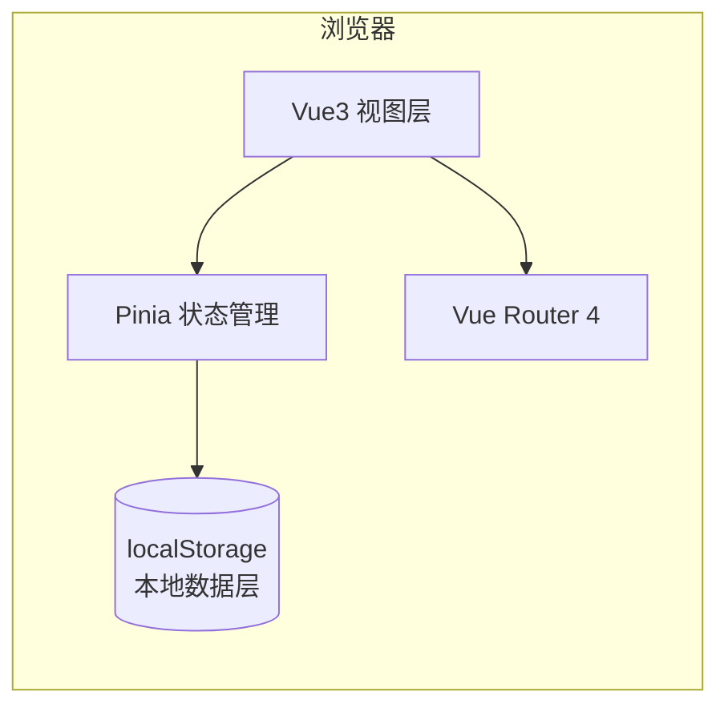

# 教师专用工作台 - 技术架构文档

## 1. 架构设计



> 本系统为**纯前端单页应用**，无后端。所有数据通过 localStorage 持久化，并支持 JSON 导入/导出。

## 2. 技术栈

- 前端框架：**Vue 3.4** + **TypeScript 5** + **Composition API**
- 构建工具：**Vite 5**
- 路由：**vue-router 4**
- 状态管理：**Pinia 2**
- 样式：**Tailwind CSS 3** + 自定义主题变量（米黄奶油色调）
- 工具库：
  - `lucide-vue-next` 图标
  - `dayjs` 日期处理
  - `nanoid` ID 生成
- 图表：纯 SVG 自绘（柱状图、雷达图、饼图），无外部图表库依赖
- 包管理：**npm**
- 模板：使用 `vue-ts` 模板（vue + vue-router + tailwind 预置）

## 3. 目录结构

```
src/
├── assets/             # 静态资源（噪点纹理、默认头像 svg）
├── components/         # 通用组件
│   ├── layout/         # 侧边栏、顶栏
│   ├── common/         # 按钮、卡片、模态框、空状态
│   └── widgets/        # 图表、空状态插画
├── composables/        # 复用 composable（useLocalStorage、useToast 等）
├── stores/             # pinia stores（user、class、student、grade、note、tool、resource）
├── views/              # 页面级组件
│   ├── Login.vue
│   ├── Dashboard.vue
│   ├── Note.vue
│   ├── ClassManage.vue
│   ├── StudentManage.vue
│   ├── GradeManage.vue
│   ├── TeacherDirectory.vue
│   ├── Toolbox.vue
│   ├── Schedule.vue
│   ├── Attendance.vue
│   ├── Homework.vue
│   ├── Notice.vue
│   ├── Resource.vue
│   ├── Profile.vue
│   └── tools/          # 各工具子页面
├── router/             # 路由配置
├── utils/              # 工具函数
│   ├── storage.ts      # localStorage 封装
│   ├── seed.ts         # 初始示例数据
│   └── format.ts       # 格式化函数
├── App.vue
├── main.ts
└── style.css           # tailwind + 自定义样式
```

## 4. 路由定义

| 路由 | 用途 | 是否需登录 |
|------|------|-----------|
| `/login` | 一键登录 | 否 |
| `/` | 工作台首页 | 是 |
| `/notes` | 笔记列表 | 是 |
| `/classes` | 班级管理 | 是 |
| `/students` | 学生管理 | 是 |
| `/grades` | 成绩管理 | 是 |
| `/teachers` | 教师通讯录 | 是 |
| `/toolbox` | 工具箱首页 | 是 |
| `/toolbox/picker` | 随机点名 | 是 |
| `/toolbox/timer` | 倒计时 | 是 |
| `/toolbox/calc` | 计算器 | 是 |
| `/toolbox/comment` | 评语生成 | 是 |
| `/toolbox/math` | 口算生成 | 是 |
| `/toolbox/schedule-maker` | 课表生成 | 是 |
| `/toolbox/color` | 取色器 | 是 |
| `/schedule` | 我的课表 | 是 |
| `/attendance` | 考勤管理 | 是 |
| `/homework` | 作业登记 | 是 |
| `/notice` | 班级公告 | 是 |
| `/resource` | 教学资源 | 是 |
| `/profile` | 个人中心 | 是 |

> 路由 meta 中标记 `requiresAuth`，未登录时跳到 `/login`。

## 5. 数据模型（localStorage）

### 5.1 ER 关系
```mermaid
erDiagram
    USER ||--o{ NOTE : "创建"
    USER ||--o{ CLASS : "任教"
    CLASS ||--o{ STUDENT : "包含"
    CLASS ||--o{ GRADE : "拥有"
    CLASS ||--o{ SCHEDULE : "拥有"
    CLASS ||--o{ ATTENDANCE : "拥有"
    CLASS ||--o{ HOMEWORK : "拥有"
    CLASS ||--o{ NOTICE : "拥有"
    STUDENT ||--o{ GRADE : "产生"
    STUDENT ||--o{ ATTENDANCE : "对应"
```

### 5.2 数据结构
```ts
interface User { id; name; subject; avatar; theme; }
interface ClassItem { id; name; grade; slogan; headTeacher; teachers[]; createdAt; }
interface Student { id; classId; name; gender; studentNo; seatNo; parentName; parentPhone; note; }
interface Grade { id; classId; subject; examName; date; scores: { studentId; score }[]; }
interface NoteItem { id; title; content; category; pinned; createdAt; updatedAt; }
interface Teacher { id; name; subject; grade; office; phone; email; }
interface ScheduleItem { id; classId; dayOfWeek; period; subject; }
interface Attendance { id; classId; date; records: { studentId; status }[]; }
interface Homework { id; classId; subject; title; content; deadline; status; }
interface Notice { id; classId; title; content; pinned; createdAt; }
interface Resource { id; title; url; category; tags[]; createdAt; }
```

### 5.3 持久化方案
- 每个 store 启动时从 `localStorage` 读取，未读取到则使用 `seed.ts` 中的初始演示数据。
- 写入采用 `watch(state, val => localStorage.setItem(key, JSON.stringify(val)), { deep: true })`。
- 个人中心提供「导出 JSON」「导入 JSON」「清空数据」三个动作。

## 6. 关键交互流程

### 6.1 一键登录
1. 用户进入应用，Pinia `userStore` 检查 localStorage 中是否有 `user`。
2. 若无，跳转 `/login`，展示米黄色卡片。
3. 用户输入姓名、选择任教学科，可选 emoji 头像，点击「开始工作」即登录。
4. 写入 localStorage，跳转 `/`。

### 6.2 成绩录入与统计
1. 选择班级 + 科目 + 考试名称。
2. 表格批量录入每名学生分数（缺考留空）。
3. 保存后自动计算平均分、及格率、优秀率、排名。
4. 统计页使用 SVG 柱状图展示分数段分布，雷达图展示班级能力维度。

### 6.3 随机点名
1. 用户选择班级，从学生列表生成池。
2. 点击「开始」后名字快速滚动；点击「停止」锁定。
3. 记录历史，可「已点过」过滤。

## 7. 主题与样式

- 通过 Tailwind 主题扩展自定义 `colors.brand.*`：
  - `cream: #FFF9EE`
  - `butter: #FFD479`
  - `mint: #7FD8A4`
  - `pink: #FF9EB5`
  - `sky: #7BC6FF`
  - `cocoa: #3D2E1F`
- 全局字体栈：`ZCOOL KuaiLe, Ma Shan Zheng, Noto Sans SC, system-ui, sans-serif`，在 `index.html` 中通过 Google Fonts 引入。
- 自定义 `.card-soft`、`.btn-pill`、`.scribble` 等实用类。

## 8. 性能与可访问性

- 路由级代码复用，不做懒加载（保持快速切换）。
- 关键交互（点名、倒计时）使用 `requestAnimationFrame`。
- 所有按钮/输入框具备 `aria-label` 与键盘可达。
- 颜色对比度满足 WCAG AA。

## 9. 运行与构建

```bash
npm install
npm run dev      # 本地开发
npm run build    # 产出 dist
npm run preview  # 预览构建结果
```
