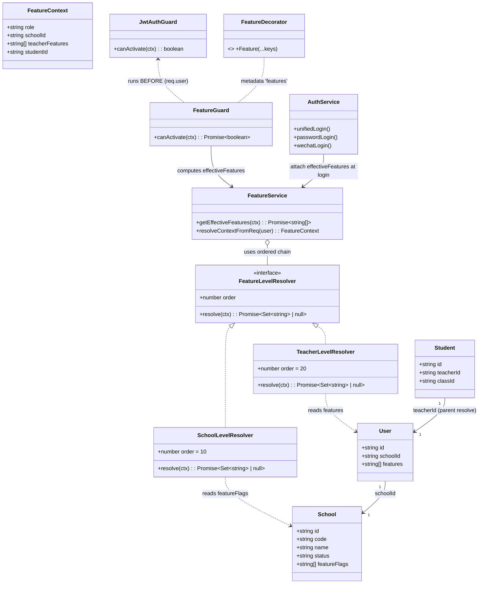
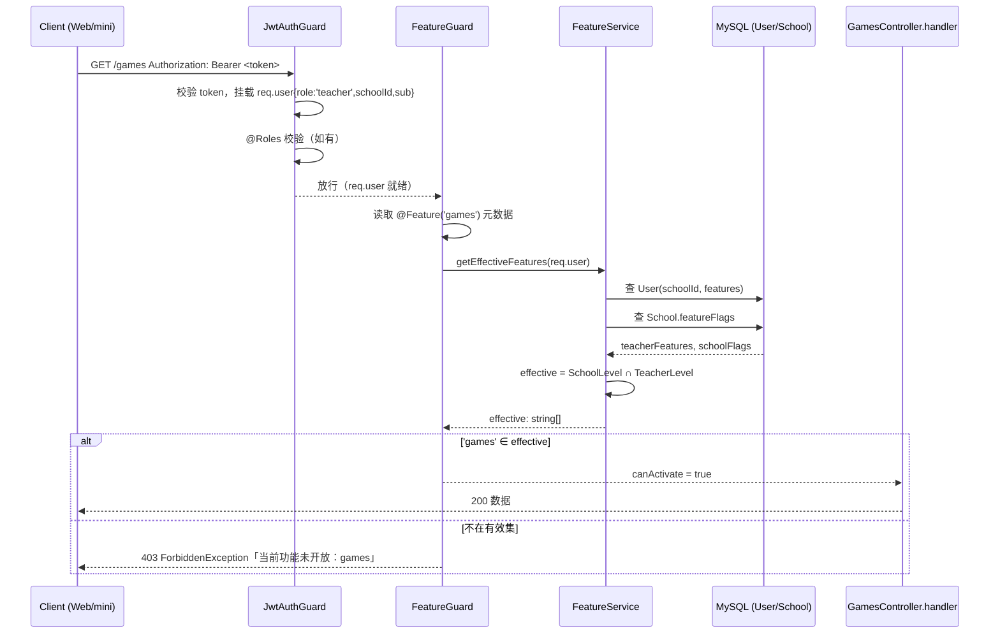
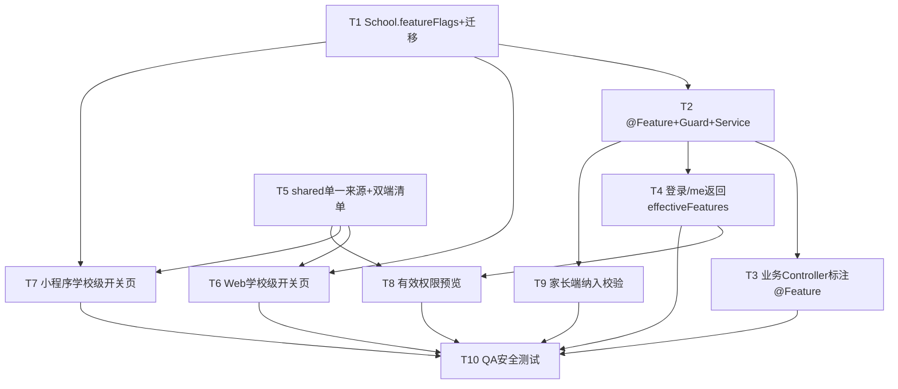

# 功能管理精细化改造 —— 增量架构设计 + 任务分解

> 项目：园丁工作台（work-system） · 增量改造
> 角色：架构师（高见远） · 面向：主理人 / 产品经理 / 工程师 / QA
> 范围：开关体系降为**二级（学校级 > 教师级）**，可插拔层级链，仅包级 key，超管独占学校级，家长端纳入校验。

---

## 1. 实现方案 + 框架选型

### 1.1 沿用技术栈（不引入新框架）

| 层 | 技术 | 说明 |
|---|---|---|
| 后端 | NestJS + TypeORM + MySQL | 既有，沿用；守卫/装饰器机制成熟 |
| Web 管理端 | Vite + React + MUI + Tailwind | 既有，沿用；API 封装集中于 `web-app/src/api/*` |
| 小程序 | uni-app (mp-weixin) + Vue3 | 既有，沿用；API 封装为 `apiCall(method, path, data)` |
| 共享常量 | `shared/constants/index.ts` | 升级为功能包 key **单一事实来源** |

**不新增第三方依赖**。TypeORM 迁移用仓库既有 `typeorm` CLI / 脚本能力，手写 migration 类即可。

### 1.2 核心难点与对策

1. **双端 key 三处定义不一致（Web 40 / mini 31 / shared 28&31）**
   → 收敛为 `shared/constants/index.ts` 的 `FEATURE_FLAGS` 单一来源；Web `ALL_FEATURES` 改为 re-export，mini `allFeatures` 改为引用/同步生成。
2. **后端无任何功能包维度守卫**
   → 新增 `@Feature(...)` 装饰器 + `FeatureGuard`，**挂在 `JwtAuthGuard` 之后**（`@UseGuards(JwtAuthGuard, FeatureGuard)`），复用其已解析的 `req.user`，与现有 `@Roles` + `Reflector` 同构。
3. **二级开关解析（学校级 ∩ 教师级）**
   → `FeatureService.getEffectiveFeatures(ctx)` 用**可插拔有序层级链（Level Resolver Chain）**：`SchoolLevelResolver`(order 10) ∩ `TeacherLevelResolver`(order 20)；将来插入 `ProjectLevelResolver`(order 15) 即扩展，**不返工**。
4. **家长端无 `schoolId`（JWT payload 仅含 studentId）**
   → `FeatureService` 内做 parent 解析：`studentId → Student.teacherId → User(教师)`，取该教师的 `schoolId` + `features` 作为上下文，再走同一层级链。

### 1.3 守卫链挂载方式

```ts
@Controller('games')
export class GamesController {
  @Get()
  @UseGuards(JwtAuthGuard, FeatureGuard)   // 顺序固定：先鉴身份，后鉴功能包
  @Feature('games')                        // 声明该方法所需功能包 key
  listGames(@Req() req) { /* ... */ }
}
```

`JwtAuthGuard` 负责：校验 Bearer、把 JWT payload 挂 `req.user`（家长 `type='parent'` → `role='parent'`），并做 `@Roles` 校验。`FeatureGuard` 在其后运行，读取 `req.user` 计算 `effectiveFeatures`，命中则放行，否则抛 `403 ForbiddenException`。

### 1.4 关键安全边界（防回归）

- **`@Feature` 只标注「面向教师/家长的功能包业务端点」**（如 games/ai/homework/… 的 teacher/parent 调用方）。
- **`/school-admin/*`、`/admin/*` 管理端点不标注 `@Feature`**（仅保留 `@Roles`），避免学校级关闭某 key 时误伤校管/超管的后台管理。
- `super` / `school_admin` 在 `FeatureGuard` 中视为 `effective = ALL`（全开），仅 teacher/parent 走二级交集。

---

## 2. 文件列表及相对路径

### 2.1 新增文件

**后端**
- `server/src/common/decorators/feature.decorator.ts` —— `@Feature(...)` 装饰器（`SetMetadata('features', keys)`）
- `server/src/common/guards/feature.guard.ts` —— `FeatureGuard implements CanActivate`
- `server/src/common/feature/feature.service.ts` —— `FeatureService`（层级链 + `getEffectiveFeatures` + parent 解析）
- `server/src/common/feature/feature.module.ts` —— `FeatureModule`（`@Global()`，导出 `FeatureService`/`FeatureGuard`）
- `server/src/common/feature/level-resolver.interface.ts` —— `FeatureLevelResolver` 接口
- `server/src/common/feature/school-level.resolver.ts` —— `SchoolLevelResolver`
- `server/src/common/feature/teacher-level.resolver.ts` —— `TeacherLevelResolver`
- `server/src/migrations/<timestamp>-AddSchoolFeatureFlags.ts` —— TypeORM 迁移（为 `schools` 表加 `feature_flags` 列）
- `server/src/auth/dto/me.dto.ts`（可选，或内联返回结构）

**Web 管理端**
- `web-app/src/api/feature.ts` —— 接口封装：`getMe()`、`updateSchoolFeatures(id, flags)`、`getSchoolFeatures(id)`、`getEffectivePreview(...)`
- `web-app/src/views/super/SchoolFeatures.vue` —— 超管「学校级功能包开关」页（嵌入学校编辑或独立 Tab）
- `web-app/src/views/school-admin/TeacherFeaturesPreview.vue` —— 教师级「有效权限预览」（或扩展既有 `Teachers.vue`）

**小程序端**
- `mini-program/src/pages/school-admin/school-features.vue` —— 超管学校级功能包开关页（独立页面）
- `mini-program/src/common/feature.js` —— 接口封装 + effective 预览计算（与 Web 同公式）

### 2.2 修改文件

**后端**
- `server/src/school/school.entity.ts` —— `School` 新增 `featureFlags: string[] | null`
- `server/src/auth/auth.controller.ts` —— 新增 `GET /auth/me`（返回 `effectiveFeatures`）
- `server/src/auth/auth.service.ts` —— `unifiedLogin` / `passwordLogin` / `wechatLogin` 登录响应补充 `effectiveFeatures`（注入 `FeatureService` 计算）
- `server/src/admin/admin.controller.ts` —— 新增 `PATCH /admin/schools/:id/features`（超管独占）；确认 `GET /admin/schools/:id` 返回 `featureFlags`
- `server/src/admin/admin.service.ts` —— 新增 `updateSchoolFeatures(id, flags)`；`getSchool` 返回 `featureFlags`
- 各「教师/家长功能包业务 Controller」（games/ai/homework/seats/rewards/growth/behavior/reading/checkin/finance/activities/duty/gallery/parents/im/notices/schedule/worklog/observation/calendar/teachers/todos/notes 等模块 controller）—— 在方法上标注 `@UseGuards(JwtAuthGuard, FeatureGuard)` + `@Feature(key)`
- `server/src/app.module.ts` —— 引入 `FeatureModule`（若非 `@Global`）

**Web 管理端**
- `web-app/src/constants/features.ts` —— `ALL_FEATURES` 改为从 `shared/constants` re-export（单一来源）
- `web-app/src/router/index.ts` —— 路由守卫改用 `effectiveFeatures` 判断（来自登录/`/me`）
- `web-app/src/layouts/AppLayout.vue` —— `hasFeature()` 改用 `auth.user.effectiveFeatures`
- `web-app/src/views/tools/Toolbox.vue` —— `hasFeature()` 改用 `effectiveFeatures`
- `web-app/src/views/school-admin/Teachers.vue` —— 教师功能包弹窗增加「有效权限预览」（学校级 ∩ 教师级）
- `web-app/src/stores/auth.ts`（auth store）—— 登录/`/me` 写入 `effectiveFeatures`

**小程序端**
- `mini-program/src/pages/school-admin/school-admin.vue` —— `allFeatures` 改为引用 `shared` 生成的清单；写路径不变（`PATCH /school-admin/teachers/:id/features`）；增加有效权限预览
- `mini-program/src/common/config` 或 store —— 注入 `effectiveFeatures`（来自登录/`/me`）

---

## 3. 数据结构和接口（类图 / 表结构）

### 3.1 表结构变更

**`schools` 表新增列：**
```sql
ALTER TABLE schools ADD COLUMN feature_flags JSON NULL COMMENT '学校级功能包开关；null/[]=该校全部功能包可用（上级默认全开）；非空数组=白名单，仅列出的 key 在该校可用';
```

**`School` 实体字段：**
```ts
@Column('simple-json', {
  nullable: true,
  comment: '学校级功能包开关。null/[]=全部可用（由上级默认全开）；非空数组=白名单，仅列出的 key 在该校可用。上级(学校级)关闭某 key → 教师级该项自动失效。',
})
featureFlags: string[] | null
```

> `User.features`（教师级）已存在、`simple-json`、nullable，语义一致（null/[]=全部可用），本次**不改动字段**，仅复用。
> `SchoolAdmin.permissions` 是「校管可管理的后台模块」，与功能包是两套概念，**本次不并入**。

### 3.2 `FeatureService.getEffectiveFeatures` 接口签名与算法

```ts
// 输入上下文（由 req.user 归一化而来）
interface FeatureContext {
  role: 'super' | 'school_admin' | 'teacher' | 'parent'
  schoolId?: string
  teacherFeatures?: string[] | null   // 教师级白名单（null/[]=全开）
  studentId?: string                  // 仅 parent：用于解析 schoolId/teacherFeatures
}

// 输出：该用户实际可用的功能包 key 数组
async getEffectiveFeatures(ctx: FeatureContext): Promise<string[]>
```

**算法（可插拔层级链）：**
```
ALL = FEATURE_FLAGS                      // 全集（来自 shared/constants 单一来源）

// 1) 超管/校管不受二级开关约束，直接全开
if (ctx.role === 'super' || ctx.role === 'school_admin') return ALL

// 2) parent 先解析出 schoolId + teacherFeatures
if (ctx.role === 'parent') {
  student = studentRepo.findOne({ where: { id: ctx.studentId } })
  teacher = userRepo.findOne({ where: { id: student.teacherId } })
  ctx.schoolId = teacher.schoolId
  ctx.teacherFeatures = teacher.features
}

// 3) 按 order 顺序执行层级链，逐层取交集（null/[] 不收窄）
effective = new Set(ALL)
for (resolver of resolvers.sort(by order)) {
  level = await resolver.resolve(ctx)        // 返回 string[] | null
  if (level == null || level.length === 0) continue   // null/[] = 全部可用，不收窄
  effective = intersect(effective, new Set(level))
}
return [...effective]

// SchoolLevelResolver.resolve(ctx): schoolRepo.findOne(ctx.schoolId)?.featureFlags ?? null
// TeacherLevelResolver.resolve(ctx): ctx.teacherFeatures ?? null
```

**公式（决策 #2 / 语义）：**
```
effective = ∩_{L ∈ orderedLevels} (L.value ?? ALL)
其中 L.value 为 null 或 [] 时退化为 ALL（不收窄）。
即：effective = SchoolLevel ∩ TeacherLevel
    - 任一级 null/[]      → 该级视为全集
    - 上级(学校级)关闭 key → 交集后该 key 失效，下级(教师级)即使开启也不可用
```

### 3.3 新增 / 调整 API 端点清单

| 方法 | 路径 | 角色 | 说明 |
|---|---|---|---|
| `GET` | `/auth/me` | 全部（含 parent） | 返回 `{ role, schoolId, effectiveFeatures, rawFeatures(教师级 features), schoolFeatureFlags, user }`；后端实时计算 |
| `PATCH` | `/admin/schools/:id/features` | `super`（独占） | body `{ featureFlags: string[] }`；更新 `School.featureFlags`；返回 school |
| `GET` | `/admin/schools/:id` | `super` | 既有；确保响应含 `featureFlags` |
| `PATCH` | `/school-admin/teachers/:id/features` | `school_admin` | **既有，不变**；校管配置教师级 `User.features` |
| （teacher/parent 业务端点） | 各功能包 GET/POST… | `teacher`/`parent` | 标注 `@UseGuards(JwtAuthGuard, FeatureGuard)` + `@Feature(key)` |

> 登录响应（`unifiedLogin`/`passwordLogin`/`wechatLogin`）同步附加 `effectiveFeatures` 字段，前端首屏即可用，避免额外 `/me` 调用；`/auth/me` 用于登录后增量刷新。

### 3.4 `@Feature` 装饰器 + `FeatureGuard` 类设计

```ts
// feature.decorator.ts
import { SetMetadata } from '@nestjs/common'
export const FEATURE_KEY = 'features'
export const Feature = (...keys: string[]) => SetMetadata(FEATURE_KEY, keys)

// feature.guard.ts
@Injectable()
export class FeatureGuard implements CanActivate {
  constructor(
    private readonly reflector: Reflector,
    private readonly featureSvc: FeatureService,
  ) {}

  async canActivate(context: ExecutionContext): Promise<boolean> {
    const handler = context.getHandler()
    const controller = context.getClass()
    // 未标注 @Feature → 不校验，直接放行（兼容未纳入改造的端点）
    const keys = this.reflector.getAllAndOverride<string[]>(FEATURE_KEY, [handler, controller])
    if (!keys || keys.length === 0) return true

    const req = context.switchToHttp().getRequest()
    const effective = await this.featureSvc.getEffectiveFeatures(req.user) // req.user 已由 JwtAuthGuard 挂载
    const ok = keys.some((k) => effective.includes(k))
    if (!ok) throw new ForbiddenException('当前功能未开放：' + keys.join('/'))
    return true
  }
}
```

### 3.5 类图（Mermaid classDiagram）



---

## 4. 程序调用流程（时序图 Mermaid）

一次「教师访问小游戏列表」请求：



`/auth/me` 时序同理（仅返回 `effectiveFeatures`，无业务 handler）。

---

## 5. 任务列表（有序、含依赖、按实现顺序）

> 说明：本 SOP 按团队既定 10 步拆解（覆盖后端 + 双前端 + 迁移 + QA）；其中 T1–T4 为安全闭环核心，必须优先。

| 任务 | 名称 | 依赖 | 优先级 |
|---|---|---|---|
| **T1** | 新增 `School.featureFlags` 字段 + TypeORM 迁移 | — | P0 |
| **T2** | `@Feature` 装饰器 + `FeatureGuard` + `FeatureService`（可插拔层级链 + parent 解析） | T1 | P0 |
| **T3** | 在教师/家长功能包业务 Controller 标注 `@UseGuards(JwtAuthGuard, FeatureGuard)` + `@Feature(key)` | T2 | P0 |
| **T4** | 登录 / `GET /auth/me` 返回 `effectiveFeatures` | T2 | P0 |
| **T5** | `shared/constants` 单一来源收敛 + Web/mini 清单替换 | — | P1 |
| **T6** | Web 学校级开关页 + 接口封装（超管 `PATCH /admin/schools/:id/features`） | T1, T5 | P1 |
| **T7** | 小程序学校级开关页 + 接口封装 | T1, T5 | P1 |
| **T8** | 教师级页「有效权限预览」（双端：学校级 ∩ 教师级） | T4, T5 | P2 |
| **T9** | 家长端纳入校验核对（parent 解析链路 + `@Feature` 标注 + DEMO_MODE 处理） | T2, T3 | P1 |
| **T10** | QA 安全测试（越权访问 / 层级链 / 迁移 / 双端一致） | T3, T4, T6, T7, T8, T9 | P0 |

### 任务依赖图（Mermaid）



---

## 6. 依赖包列表

**预计无需新增第三方依赖。**

| 包 | 用途 | 是否新增 |
|---|---|---|
| `typeorm` | 既有；手写 migration 类（无需额外迁移工具） | 否 |
| `@nestjs/common` / `@nestjs/core` | `SetMetadata` / `Reflector` / `CanActivate` / 守卫 | 否（既有） |
| `shared` | 功能包 key 单一来源 `FEATURE_FLAGS` | 否（既有，本次收敛） |

> 若工程未启用 TypeORM migration runner，可改用手写 SQL 脚本（`scripts/` 下）执行 `ALTER TABLE`，同样零新增依赖。

---

## 7. 共享知识（跨文件约定）

1. **key 命名规范**：`camelCase`，唯一事实来源 = `shared/constants/index.ts` 的 `FEATURE_FLAGS`。Web `ALL_FEATURES`、mini `allFeatures` 均由此派生，禁止再硬编码。
2. **`effectiveFeatures` 语义**：`effective = 学校级有效集 ∩ 教师级有效集`；某级 `null/[]` = 该级全集（不收窄）；上级（学校级）关闭某 key → 下级（教师级）该项自动失效。
3. **空值 = 全开**：`featureFlags` / `features` 为 `null` 或 `[]` 均表示「全部可用」，不做「空=全关」解释。
4. **守卫顺序固定**：`@UseGuards(JwtAuthGuard, FeatureGuard)`；`@Feature` 仅标注教师/家长功能包业务端点，`/admin/*`、`/school-admin/*` 管理端点**不标注**（防误伤）。
5. **角色处理**：`super` / `school_admin` 在 `FeatureGuard` 中 `effective = ALL`；仅 `teacher` / `parent` 走二级交集。
6. **家长解析**：parent 无 `schoolId`，经 `studentId → Student.teacherId → User` 取 `schoolId` + `features`，复用同一层级链。
7. **错误响应统一**：未授权统一 `403 ForbiddenException`，文案「当前功能未开放：<key>」；与既有 `401`（未登录/过期）区分。
8. **DEMO_MODE**：仅 `dev`/`preview` 前端展示用（`DEMO_MODE_ENABLED`）；**后端 `@Feature` 校验不因 DEMO_MODE 关闭**，安全闭环不留盲区（详见待明确 #5）。
9. **迁移兼容**：旧数据 `['games']` 已等价于「games 包开启」，迁移仅加列、不改动 `User.features`，零兼容负担。

---

## 8. 待明确事项（需用户 / 工程师确认）

1. **学校级开关页入口**：超管后台入口放哪里？—— 在学校编辑弹窗内新增「功能包」Tab，还是独立「学校功能包」列表页？（影响 T6/T7 页面结构）
2. **`effectiveFeatures` 缓存**：每次请求查 `User` + `School` 两张表；是否加缓存（Redis/进程内 TTL）？默认建议**不加**（数据一致性优先，QPS 低），如上线后性能不足再补。
3. **403 响应结构**：未授权 403 的 body 结构是否沿用既有异常格式（`{ code, message }`）？前端统一拦截逻辑（跳转 forbidden 页 vs toast）如何对齐双端？
4. **家长端 effective 模型**：家长的有效功能包 = 复用「孩子所在教师的 `User.features`」作为教师级（本设计默认），还是家长有独立基线（如 `ROLE_OPTIONS.parent.features`）？需产品确认。
5. **DEMO_MODE 是否也禁用后端校验**：安全闭环要求**不禁用**；但需用户明确确认 demo/preview 环境后端 `@Feature` 仍生效（仅前端 UI 展示走 DEMO_MODE）。
6. **学校级 `featureFlags` 的 key 范围**：是否与教师级 `FEATURE_FLAGS` 完全相同？还是学校级有独立子集（如超管不应关闭 `demo`/`tools` 等内部管理项）？需明确白名单值域。
