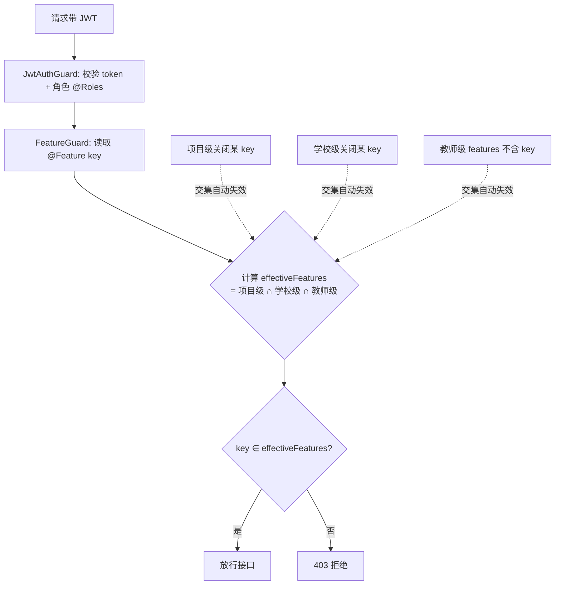

# 功能包权限精细化改造 · 增量 PRD（简单 PRD 形态）

> 文档类型：增量 PRD（已有系统精细化改造，非从零搭建）
> 作者：许清楚（产品经理）
> 对应需求：校管逐教师勾选功能包仅 UI 层生效 → 后端/小程序端越权漏洞 + 缺三级开关
> 版本：v1.0（探索后产出，待架构师评审与用户澄清）

---

## 一、项目信息

| 项 | 内容 |
|---|---|
| Language | 中文（与用户需求一致） |
| 后端技术栈 | NestJS + TypeORM + MySQL（既有，沿用） |
| Web 管理端技术栈 | Vite + React + MUI + Tailwind（目录 `web-app/`，既有，沿用） |
| 小程序技术栈 | uni-app (mp-weixin) + Vue3（目录 `mini-program/`，既有，沿用） |
| Project Name | `feature_management_hardening` |
| 改造性质 | 增量改造，不新引入框架；强制约定：前端改动 Web 端与小程序端须同时改、功能与表现一致；命名 camelCase；DEMO_MODE 仅 dev/preview 启用 |

### 原始需求复述（逐字要点）
1. **后端权限守卫**：实现 `@Feature(key)` 装饰器守卫，对所有涉及功能包访问的接口强制校验，未授权请求被拦截。
2. **多端统一校验**：小程序端接入与 Web 端一致的权限校验逻辑，杜绝绕过 Web UI 越权。
3. **三级开关体系**：在教师级之上增加学校级、项目级开关，优先级 **项目级 > 学校级 > 教师级**（上级关闭则下级自动失效）。
4. **数据迁移**：对约 30 个包级 key 的配置数据提供兼容迁移方案，升级后既有权限配置不丢失。
5. **安全测试**：覆盖越权场景，验证小程序端、Web 端及直接 API 调用均无法绕过守卫。

---

## 二、现状关键发现（探索结论，供架构师/工程师直接使用）

> 已用 Grep/Read 核实，以下为代码事实，非推测。

### 1. 功能包 key 的存储位置与维度
- **教师级开关已存在**：字段 `User.features`（`server/src/users/user.entity.ts:74-75`），类型 `simple-json`，注释「管理员配置的功能权限，空数组或 null = 全部可用」。这是**唯一**落库的功能包维度，挂在**教师（users 表）**维度。
- **学校级开关：不存在**。`School` 实体（`server/src/school/school.entity.ts`）仅有 code/name/address/contact/phone/status，**无任何功能包开关字段**。
- **项目级开关：不存在**，且系统当前**无任何 project/项目 实体**（全仓搜索 `project|项目` 仅命中文档/注释，后端无对应实体）。详见待确认问题 #1。

### 2. 包级 key 的权威清单（约 30 个，实际存在多份、已不一致）
- **Web 端权威目录**：`web-app/src/constants/features.ts` 的 `ALL_FEATURES`，**共 40 个 key**（classes/students/exams/grades/analysis/attendance/homework/tools/seats/games/rewards/growth/behavior/reading/checkin/finance/activities/duty/gallery/parents/im/notices/ai/schedule/worklog/observation/calendar/teachers/todos/notes/demo/office_tools/subject_tools/quicktool/grade_trend/picker_history/reward/translate/blackboard/speech）。
- **小程序端内联副本**：`mini-program/src/pages/school-admin/school-admin.vue:430` 的 `allFeatures`，**仅 31 个 key**（为 Web 子集，缺少 office_tools/subject_tools/quicktool/grade_trend/picker_history/reward/translate/blackboard/speech，且 analysis 标签不同）。**两端清单已不一致**——这是强制约定下的现存偏差。
- **第三处**：`shared/constants/index.ts:91` 的 teacher 角色 features 列表（28 个）。共三处定义功能 key，**无单一事实来源**。

### 3. Web 管理端「逐教师勾选功能包」的 UI 与保存逻辑
- UI：`web-app/src/views/school-admin/Teachers.vue`（功能权限弹窗，约 line 102–387），用 `ALL_FEATURES` 渲染勾选框，保存调用 `updateTeacherFeatures(id, selected)`。
- API 封装：`web-app/src/api/school-admin.ts:76-77` → `PATCH /school-admin/teachers/${id}/features`。
- 后端落库：`SchoolAdminController.PATCH teachers/:id/features`（`server/src/school-admin/school-admin.controller.ts:73-77`）→ `SchoolAdminService.updateTeacherFeatures`（`server/src/school-admin/school-admin.service.ts:287-293`），直接 `user.features = features` 保存。
- **小程序端同一入口**：`mini-program/src/pages/school-admin/school-admin.vue:632` 同样 `apiCall('PATCH','/school-admin/teachers/'+id+'/features',{features:sel})`——即**写路径双端已对齐**，问题在**读/校验路径**不校验。

### 4. 现有客户端「校验」仅是 UX 层（非安全边界）
- Web：`web-app/src/router/index.ts:254-271` 全局路由守卫做登录态+角色+功能权限检查，但注释明确写道「localStorage 中的 role / features 仅用于 UX 层跳转与菜单显隐」；`AppLayout.vue:279` `hasFeature`、Toolbox.vue:121 均基于本地 `auth.user.features` 判断。**可篡改，非防线。**
- 小程序：`mini-program/src/pages/toolbox/toolbox.vue:290-291` 用 `auth.features` 过滤可见分区，同样是客户端显隐。
- 结论：两端都把 `features` 当作前端展示开关，**后端从未校验**——这是越权漏洞根因。

### 5. 现有后端守卫模式（@Feature 应对齐此风格）
- 角色装饰器：`server/src/common/decorators/roles.decorator.ts` → `Roles(...roles) => SetMetadata('roles', roles)`。
- 守卫：`server/src/common/guards/jwt-auth.guard.ts`（`JwtAuthGuard implements CanActivate`），用 `Reflector.getAllAndOverride('roles', [handler, controller])` 读取角色元数据，校验 `req.user.role`，并统一把 JWT payload 挂到 `req.user`。
- **全仓无 `@Feature` 装饰器、无功能包维度守卫**；`@Roles` 只管角色越权，不管功能包越权。新增 `@Feature(key)` 应沿用 `SetMetadata` + `Reflector` 模式，并在 `JwtAuthGuard` 之后（或合并）运行，读取 `req.user` 计算 effectiveFeatures。
- 注意区分：`SchoolAdmin.permissions`（`server/src/school-admin/school-admin.entity.ts:22`，默认含 ai/tools/games 等）是「校管可管理的后台模块」，**与教师功能包 `User.features` 是两套概念**，不要混淆（见待确认 #5）。

### 6. 关键文件/实体速查表
| 关注点 | 位置 |
|---|---|
| 教师级功能包存储 | `server/src/users/user.entity.ts` `User.features` |
| 功能包写接口（双端共用） | `PATCH /school-admin/teachers/:id/features`（`school-admin.controller.ts:73`） |
| Web 勾选 UI | `web-app/src/views/school-admin/Teachers.vue` |
| 小程序勾选 UI | `mini-program/src/pages/school-admin/school-admin.vue:430/632` |
| Web key 清单 | `web-app/src/constants/features.ts` `ALL_FEATURES`（40） |
| 小程序 key 清单 | `mini-program/.../school-admin.vue` `allFeatures`（31，子集） |
| 角色守卫模式 | `common/decorators/roles.decorator.ts` + `common/guards/jwt-auth.guard.ts` |
| 学校实体 | `server/src/school/school.entity.ts`（无开关字段） |

---

## 三、产品目标（Product Goals）

1. **消除越权漏洞**：所有功能包相关接口在后端强制校验，Web UI / 小程序 / 直接 API 调用任一路径均无法绕过。
2. **建立三级开关**：在既有教师级之上补齐学校级、项目级开关，按「项目级 > 学校级 > 教师级」优先级生效，上级关闭下级自动失效。
3. **双端一致**：Web 与小程序在功能包配置 UI、有效权限展示、校验逻辑上保持一致，杜绝「改一端即可越权」。

---

## 四、用户故事（User Stories）

- **校管（school_admin）**：作为校管，我希望在学校维度统一开启/关闭某些功能包（如关闭 games），以便该校所有教师在该包上自动失效，而无需逐个教师修改。
- **超管（super）**：作为超管，我希望在项目/平台维度配置功能包总开关，以便按项目生命周期收紧或放开能力，并审计下级变更。
- **教师（teacher）**：作为教师，我希望我能用的功能包在 Web 和小程序两端一致，且不会因为切换客户端或篡改本地状态而看到/调用未授权功能。
- **家长（parent）**：作为家长，我希望我可见的学生相关功能（如家长联系/公告）受同一套开关约束，避免校管关闭后我仍能访问（待确认 #4 是否纳入）。

---

## 五、需求池（Requirements Pool）

优先级：**P0=必须（本次安全闭环）｜P1=应当（三级开关+迁移+双端一致）｜P2=增强（测试/可观测）**

### P0（Must）
- **P0-1 后端 @Feature 守卫**：新增 `@Feature(key)` 装饰器（`SetMetadata('feature', key)`）与 `FeatureGuard`（沿用 `Reflector` + `req.user` 模式），对所有功能包相关控制器/路由强制校验；未授权返回 403。
- **P0-2 三级优先级解析**：实现 `effectiveFeatures(user)` = 项目级 ∩ 学校级 ∩ 教师级；上级关闭则下级失效（交集语义）。空数组/null 统一表示「该级全部可用」。
- **P0-3 双端统一校验**：小程序端接入与 Web 一致的权限校验——以**后端 @Feature 为唯一安全边界**，两端本地 `features` 仅作 UX 显隐，不再作为防线。
- **P0-4 后端下发有效权限**：在登录/me 响应及关键接口返回 `effectiveFeatures`，供双端一致消费，避免两端各自计算导致偏差。
- **P0-5 补齐 Web 端 meta.feature**：确认所有功能包路由已标注 `meta.feature`，消除客户端校验缺口（UX 层）。

### P1（Should）
- **P1-1 学校级开关模型 + UI**：`School` 新增 `featureFlags`（simple-json，默认全开）；Web 与小程序校管/超管后台提供学校级开关页（toggle 列表）。
- **P1-2 项目级开关模型 + UI**：待确认项目概念后，新增项目级开关模型与配置页（Web + 小程序）。
- **P1-3 数据迁移**：保留既有 `User.features`（教师级）不丢；学校级/项目级默认全开，确保升级后既有配置行为不变；提供可逆迁移脚本与回滚。
- **P1-4 单一事实来源**：将功能包 key 收敛到 `shared/constants`，消除 Web/mini/role 三处定义，保证双端清单一致（解决 40 vs 31 偏差）。
- **P1-5 教师级页「有效权限」预览**：在 `Teachers.vue` 功能权限弹窗展示叠加项目/学校级后的**有效结果**，区分「已配置」与「实际可用」。

### P2（Nice to have）
- **P2-1 安全测试**：越权场景用例覆盖小程序端、Web 端、直接 API 调用三种路径，验证均被拦截。
- **P2-2 审计日志**：记录功能包开关变更（谁/何时/哪级/哪 key）与越权拦截事件。
- **P2-3 可观测性**：未授权访问计数/告警指标。
- **P2-4 DEMO_MODE 行为约定**：仅 dev/preview 启用，功能包校验在演示环境不阻断展示（明确与安全环境差异）。

---

## 六、UI 设计稿（结构化描述，文字即可）

### 层级与交互模型
```
项目级开关（超管/平台）  ─┐
                          ├─ 交集 → effectiveFeatures → 双端统一消费
学校级开关（超管/校管）  ─┤
                          │
教师级开关（校管逐教师）  ─┘   （上级关闭 → 下级该项自动失效，UI 置灰并提示「被上级关闭」）
```

### 1) 学校级开关页（新增）
- **入口**：Web 超管/校管后台「功能开关 → 学校级」；小程序校管后台对应页。
- **布局**：左树/分组（班级管理、学情考试、课堂工具、学生评价、家校沟通、AI 备课、教师办公、个人）；右侧为 40 个 key 的开关列表（默认全开）。
- **交互**：切换即调 `PATCH /school-admin/school/features`（新增接口）；顶部显示「受项目级影响」的只读提示；被项目级关闭的项置灰不可改。
- **双端一致**：Web 与小程序同结构、同文案、同接口。

### 2) 项目级开关页（新增，依赖待确认 #1）
- **入口**：超管后台「功能开关 → 项目级」+ 项目选择器。
- **布局**：选定项目后，同学校级的 40 key 开关列表；顶部显示该项目归属学校。
- **交互**：切换调新增 `PATCH /admin/projects/:id/features`；仅超管可改（待确认权限划分）。

### 3) 教师级开关页（既有，增强）
- **位置**：`Teachers.vue` 功能权限弹窗（保留）。
- **增强**：在勾选区上方增加「有效权限预览」区块，展示叠加学校/项目级后的实际可用 key；勾选项若被上级关闭，显示锁定态并说明原因。
- **双端**：小程序 `school-admin.vue` 同步展示有效权限预览。

### Web 端新增 vs 小程序端对应
| 能力 | Web 端 | 小程序端 |
|---|---|---|
| 学校级开关 | 新增后台页 | 新增校管页（同结构） |
| 项目级开关 | 新增超管页 | 新增超管页（同结构） |
| 教师级有效预览 | Teachers.vue 增强 | school-admin.vue 增强 |
| 本地校验 | 保留 UX 显隐 | 保留 UX 显隐 |
| 安全边界 | 后端 @Feature | 后端 @Feature（同一接口） |

---

## 七、待确认问题（Open Questions）

1. **「项目」概念如何定义？**（最关键）后端当前无任何 project 实体。项目级开关的「项目」映射到：① 新建 `Project` 实体？② 复用既有 `semester`（学期）？③ 复用 `class`（班级）？项目与学校是 1:N 还是 N:N？——直接决定 P1-2 数据模型与 P0-2 解析实现。
2. **学校级/项目级开关由谁配置？** 超管独占？还是超管管项目级+学校级、校管只管教师级？权限划分未定。
3. **功能包 key 精确清单与单一来源**：Web 40 个 vs 小程序 31 个（已不一致）。以哪份为准？是否先盘点收敛为 `shared/constants` 单一来源？本次需求明确为「包级 key」，但 `deliverables/gstack/feature-management-plan-2026-07-30.md` 曾提出「项级」（games.2048 等）——请确认本次**仅做包级**，避免范围蔓延与向后兼容（旧 `['games']` 需等价于 `['games.*']`）。
4. **家长端是否纳入功能包校验？** `parents/im/notices` 等 key 涉及家长可见内容；家长角色是否也须 `@Feature` 校验？
5. **`SchoolAdmin.permissions` 与教师 `User.features` 是否同一套？** 校管自己的可管理模块（默认含 ai/tools/games）是否也要纳入三级开关？需避免两套概念混淆导致实现错误。
6. **空值语义统一**：三级中某级为空数组/null 表示「全部可用」还是「全部关闭」？需与现有 `User.features` 语义（空=全开）对齐，迁移与解析逻辑必须一致。

---

## 八、权限解析与守卫流程（Mermaid）



---

## 附：最关键的 3-5 条待确认问题摘要（供主理人快速决策）

1. **「项目」概念不存在于后端**，项目级开关需先定义映射（新建 Project 实体 / 复用学期 / 复用班级）及项目-学校归属关系——这是 P0-2/P1-2 的前置阻塞项。
2. **功能包 key 清单两端不一致**（Web 40 vs 小程序 31），须先收敛为 `shared/constants` 单一来源，并确认本次仅做「包级」、不引入「项级」（避免范围蔓延与 `'games'`→`'games.*'` 兼容坑）。
3. **学校级/项目级开关的运维权限归属**未定（超管 vs 校管分层？），影响后端接口鉴权与 UI 入口设计。
4. **家长端是否纳入功能包维度校验**（`parents/im/notices` 等）需明确，否则存在校验盲区。
5. **`SchoolAdmin.permissions`（校管可管理模块）与教师 `User.features` 是两套概念**，须确认是否并入三级开关，避免实现混淆。
