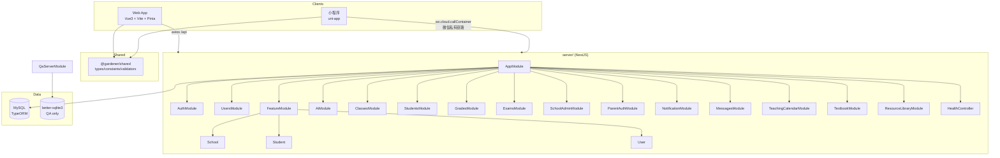

# 园丁工作台 · 全系统梳理与测试执行总报告

> 生成时间：2026-08-03  
> 项目：teacher-work-system  
> 范围：Web 端 + 微信小程序端 + 后端 API 全量梳理与测试  
> 梳理来源：架构师高见远《技术架构梳理报告》+ 主理人基于 router/pages.json 的静态核对

## 1. 系统梳理摘要

### 1.1 4 类角色
| 角色 | 说明 | Web 路由前缀 | 小程序页面前缀 |
|------|------|--------------|----------------|
| super | 超管 | `/super/*` | `pages/admin/*` |
| school_admin | 校管 | `/school-admin/*` | `pages/school-admin/*` |
| teacher | 教师 | `/teacher/*` | 其余业务页（默认） |
| parent | 家长 | `/parent/*` | `pages/parent/*` |

### 1.2 Web 端页面清单（按角色）
- **super**：Dashboard、Schools、Admins、AuditLogs、PlatformConfig、AiProviders、SchoolFeatures
- **school_admin**：Dashboard、Teachers、Classes、Students、Notices、Textbooks、ResourceLibrary、FeatureFlags
- **teacher**：Dashboard、Notifications、Profile、Config、Todos、Notes、Schedule、MySchedule、Notices、DataManager、Classes、Students、StudentInfoReview、DutyRoster、DutyConfig、ClassFinance、ClassActivities、Gallery、MyGallery、Exams、Grades、ExamAnalysis、DataDashboard、Radar、ExamDetail、StudentGrades、Attendance、Homework、Rewards、ScoreRecords、GroupScores、Leaderboard、Growth、Behavior、ReadingLog、Checkin、Awards、AwardCategories、ParentContacts、MessageBoard、NoticeTemplates、AiChat、AiImage、AiResources、LessonPlans、Knowledges、Textbook、ResourceLibrary、Papers、PaperQueries、LessonPlanTemplates、AiGenerator(lesson/knowledge/paper)、WorkLog、LessonObs、TeachingCalendar、TeacherDirectory、TeacherDetail、OfficeTranslate、OfficePaper、OfficeBlackboard、OfficeSpeech、PlanTemplateLib、Toolbox、RandomPicker、RandomGrouper、Dice、Timer、Calc、SeatMap、ScorePanel、FlowerGame、CommentGen、Summary、ClassDuty、ScheduleMaker、StrokeOrder、WritingMaterials、Poetry、Dictation、Reading、Essay、Idiom、Pinyin、MathGen、VerticalCalc、AnswerCard、MultiplicationTable、UnitConversion、MathMistakes、WordCard、SentencePractice、Listening、Grammar、SceneDialogue、Spell、Speaking、EnglishStory、PlanTemplates、Thesis、LessonObservation、OfficeTools、SubjectTools、SubjectList、SubjectDetail、QuickTool、GradeTrend、PickerHistory、Reward、Games(合集)、小游戏(xN)
- **parent**：Dashboard、Textbook、KidsCompare

### 1.3 小程序端页面清单（按角色）
- **super/admin**：pages/admin/*（与 Web 超管对齐）
- **school_admin**：pages/school-admin/*（与 Web 校管对齐）
- **teacher**：pages/ai、pages/ai-center、pages/analysis、pages/attendance、pages/award-categories、pages/award-record、pages/behavior-record、pages/checkin、pages/class-activities、pages/class-duty、pages/classes、pages/dashboard、pages/data-dashboard、pages/data-manager、pages/duty-config、pages/duty-roster、pages/english-story、pages/essay、pages/exam-detail、pages/exams、pages/gallery、pages/games、pages/grades、pages/grade-trend、pages/grouper、pages/group-scores、pages/growth、pages/homework、pages/im、pages/image-creation、pages/knowledges、pages/leaderboard、pages/lesson-observation、pages/lesson-plans、pages/lesson-plan-templates、pages/login、pages/messages、pages/my-gallery、pages/notes、pages/notice、pages/notice-templates、pages/notifications、pages/office、pages/parent-contacts、pages/parent、pages/picker-history、pages/plane、pages/plan-templates、pages/poetry、pages/qr、pages/random-picker、pages/reading-log、pages/resource-library、pages/reward-record、pages/schedule、pages/score-records、pages/seats、pages/sentence-practice、pages/spelling、pages/student-grades、pages/student-info-update、pages/students、pages/teacher-detail、pages/teacher-directory、pages/teaching-calendar、pages/tools、pages/workspace 等
- **parent**：pages/parent/*、pages/parent-login/* 等

### 1.4 后端接口分层（按模块，部分）
- **认证**：`/auth/unified-login`、`/auth/wechat-login`、`/auth/bind-*`、`/parent-auth/login`
- **超管**：`/admin/schools`、`/admin/school-admins`、`/admin/audit-logs`、`/admin/teachers`、`/config/app`、`/ai-providers`
- **校管**：`/school-admin/dashboard`、`/school-admin/teachers`、`/school-admin/classes`、`/school-admin/students`、`/school-admin/notices`、`/school-admin/resource-library/*`
- **教师业务**：`/classes`、`/students`、`/exams`、`/grades`、`/grades/analysis/*`、`/attendances`、`/homework`、`/notices`、`/messages`、`/notes`、`/teaching-calendar`
- **评价与成长**：`/awards`、`/award-categories`、`/growth`、`/behavior-records`、`/reading-log`、`/checkin`、`/score-records`、`/group-scores`、`/leaderboard`
- **家校**：`/parent-contact`、`/student-parent`、`/student-info-update`
- **AI**：`/ai/chat`、`/ai/parse`、`/ai/gen-image`、`/ai/gen-video`、`/ai/asr`、`/ai/ocr`、`/ai/analyze-exam`、`/ai/diagnose`
- **办公**：`/backups`、`/lesson-observation`、`/duty-roster`、`/seats`、`/gallery`、`/my-gallery`
- **资源库**：`/resource-library/poems`、`/resource-library/formulas`、`/resource-library/words`
- **游戏与工具**：`/games/*`、`/tools/*`（部分为前端本地逻辑，不涉及后端）

### 1.5 双端差异分析
- **功能覆盖**：Web 端页面更全（大量学科工具/小游戏），小程序以高频业务为主
- **家长端**：Web 仅 Dashboard/Textbook/Compare；小程序覆盖更多家校场景
- **AI 功能**：双端均有，但 Web 有更多 AI 生成器入口
- **数据一致性**：两端共用同一后端 API，数据模型一致；差异主要在前端交互与页面组织

## 2. 技术架构补充（来自架构师高见远）

### 2.1 技术栈
- **Web**：Vue 3 + Vite + Pinia + Vue Router + Axios + Tailwind CSS + MUI
- **小程序**：uni-app（Vue 3）+ Vite 5 + @qiun/ucharts + docx/xlsx/marked
- **后端**：NestJS + Express + TypeORM + MySQL + JWT + Swagger + Throttler
- **共享包**：`@gardener/shared`（TypeScript，file:../shared）
- **部署**：NestJS 静态托管 `web-app/dist`；API 前缀 `/api`；健康检查 `/health`

### 2.2 模块依赖图

### 2.3 接口清单（按控制器分类，部分）
详见架构师报告第 3 节。核心清单已整合进 1.4。

### 2.4 数据流（关键业务）
- **教师登录与权限生效**：unified-login → JWT → effectiveFeatures → 前端菜单显隐 + 后端 @Roles/@Feature 双重校验
- **成绩录入与分析**：创建考试 → 导入/录入成绩 → analysis/exam|trend|rank|student|weak → AI 分析报告
- **学校管理导入**：上传文件/图片 → AI parse/ocr → 结构化 → 批量写入班级/学生/教师
- **小程序微信链路**：wx.cloud.callContainer → 云托管转发 → NestJS /api

### 2.5 已知技术债/风险点
- **依赖路径**：`file:../shared` 在跨机器/CI 场景易失败
- **JWT 安全**：弱默认值风险；生产已拦截但本地易裸奔
- **限流**：ThrottlerGuard 使用进程内存，横向扩容后配额倍增
- **数据迁移**：启动期 SQL 迁移失败不阻塞启动
- **小程序双角色**：教师/家长双 token 切换，存储键多，易状态残留
- **Web 请求路径**：历史上有硬编码 `/api/` 导致双前缀问题，已修复但需持续警惕

## 3. 测试策略

### 3.1 测试分层
| 层级 | 内容 | 工具/方式 |
|------|------|-----------|
| 接口测试 | 全量 RESTful 接口，覆盖 CRUD、鉴权、错误处理、参数校验 | `qa/api-tests.mjs`（已有）+ 新增扩展 |
| 功能测试 | 按角色遍历核心业务流程 | `qa/functional-tests-v2.mjs`（已有，75 条）+ 补全遗漏模块 |
| 冒烟测试 | Web + 小程序全页面渲染与白屏检测 | `e2e/web.smoke.mjs` + `e2e/mini.smoke.mjs` |
| 性能测试 | 关键接口并发压测 | `qa/performance-tests.mjs`（已有） |
| UI 测试 | 关键页面布局、响应式、交互一致性 | 人工抽检 + Playwright（新增） |

### 3.2 测试数据
- 使用 `qa/seed-data.mjs` 生成基础数据（5 校 × 20 教师 × 3 班 × 20 学生）
- 按需扩展边界数据（如超长姓名、非法分数、越权 token 等）
- 云端测试前需重新 seed 或确认 `qa-env.json`  token 有效性

### 3.3 执行计划
1. **Phase 1**：接口全量回归（云端云托管）
2. **Phase 2**：功能测试补全（覆盖遗漏模块）
3. **Phase 3**：Web + 小程序冒烟
4. **Phase 4**：性能压测
5. **Phase 5**：缺陷修复与回归

## 4. 已知资产
- `qa/api-surface.json`：接口清单（已自动提取）
- `qa/functional-tests-v2.mjs`：功能测试套件（75 条，本地 :3100 全通过）
- `qa/performance-tests.mjs`：性能测试套件
- `e2e/web.smoke.mjs`：Web 端全路由冒烟
- `e2e/mini.smoke.mjs`：小程序等价冒烟（H5 + wx.shim）
- `e2e/mini-baseline.json`：小程序已知失败基线
- `server/scripts/seed-data.ts`：种子数据脚本
- `qa/qa-env.json`：本地 QA 环境 token 与测试数据 ID

## 5. 产品经理关键发现（许清楚《系统梳理报告》）

### 5.1 家长端差异
- Web 家长端仅 3 页（Dashboard/Textbook/Compare），小程序家长端更丰富（家长中心/资源库/跨娃比对/登录/信息修改申请等）
- 家长端独立模块为 parent-auth，支持多娃切换与跨娃比对

### 5.2 AI 功能差异
- Web 端：SSE 流式对话（`/ai/chat`），完整 AI 工作台
- 小程序端：同步对话（`/ai/chat-sync`），AI 备课中心聚合页

### 5.3 校管端差异
- Web 校管端功能完整（资源库/教材/导出等）
- 小程序校管端仅基础页面（学校管理/功能包/教师/班级/学生/公告），缺少高级功能

### 5.4 消息系统双轨
- Web：留言板（messages）+ IM 腾讯云
- 小程序：messages 页面 + IM，需确认是否复用同一套接口

### 5.5 权限模型
- 后端采用 JWT + @Roles + @FeatureGuard 三层权限控制
- 教师功能权限通过 effectiveFeatures（学校级 ∩ 教师级）动态计算
- 前端需在登录/me 后缓存 effectiveFeatures 并用于菜单显隐

## 6. 测试策略

### 6.1 测试分层
| 层级 | 内容 | 工具/方式 |
|------|------|-----------|
| 接口测试 | 全量 RESTful 接口，覆盖 CRUD、鉴权、错误处理、参数校验 | `qa/api-tests.mjs`（已有）+ 新增扩展 |
| 功能测试 | 按角色遍历核心业务流程 | `qa/functional-tests-v2.mjs`（已有，75 条）+ 补全遗漏模块 |
| 冒烟测试 | Web + 小程序全页面渲染与白屏检测 | `e2e/web.smoke.mjs` + `e2e/mini.smoke.mjs` |
| 性能测试 | 关键接口并发压测 | `qa/performance-tests.mjs`（已有） |
| UI 测试 | 关键页面布局、响应式、交互一致性 | 人工抽检 + Playwright（新增） |

### 6.2 测试数据
- 使用 `qa/seed-data.mjs` 生成基础数据（5 校 × 20 教师 × 3 班 × 20 学生）
- 按需扩展边界数据（如超长姓名、非法分数、越权 token 等）
- 云端测试前需重新 seed 或确认 `qa-env.json` token 有效性

### 6.3 执行计划
1. **Phase 1**：接口全量回归（云端云托管）
2. **Phase 2**：功能测试补全（覆盖遗漏模块）
3. **Phase 3**：Web + 小程序冒烟
4. **Phase 4**：性能压测
5. **Phase 5**：缺陷修复与回归

## 7. 已知资产
- `qa/api-surface.json`：接口清单（已自动提取）
- `qa/functional-tests-v2.mjs`：功能测试套件（75 条，本地 :3100 全通过）
- `qa/performance-tests.mjs`：性能测试套件
- `e2e/web.smoke.mjs`：Web 端全路由冒烟
- `e2e/mini.smoke.mjs`：小程序等价冒烟（H5 + wx.shim）
- `e2e/mini-baseline.json`：小程序已知失败基线
- `server/scripts/seed-data.ts`：种子数据脚本
- `qa/qa-env.json`：本地 QA 环境 token 与测试数据 ID

## 8. 待产品经理补充
- 家长端完整功能清单与流程
- 教师端完整功能清单与流程
- 双端差异矩阵（功能级）
- 边界/异常场景清单

---
*报告持续更新中*
