# 园丁工作台 · 系统架构说明文档

## 1. 架构总览

### 1.1 系统上下文图 (C4 Context)

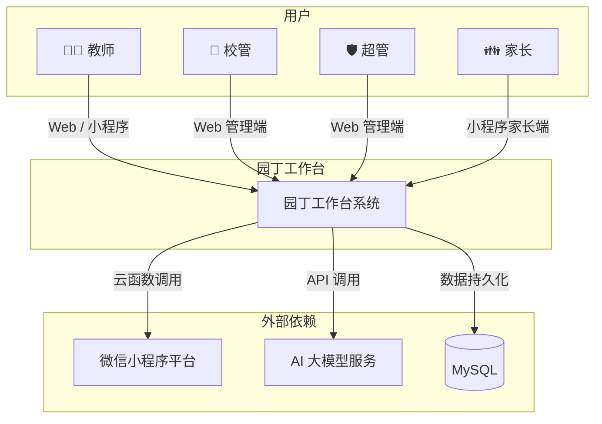

### 1.2 技术架构分层图

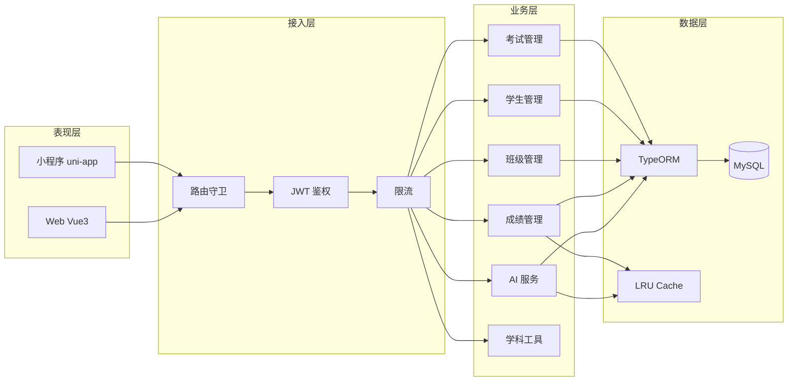

---

## 2. 后端架构 (NestJS)

### 2.1 模块依赖图

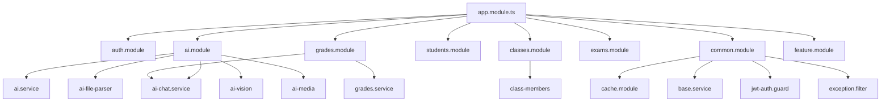

### 2.2 请求处理流水线

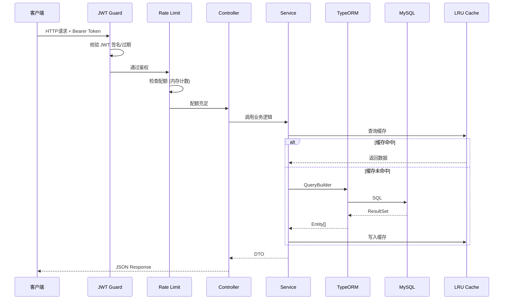

### 2.3 缓存架构

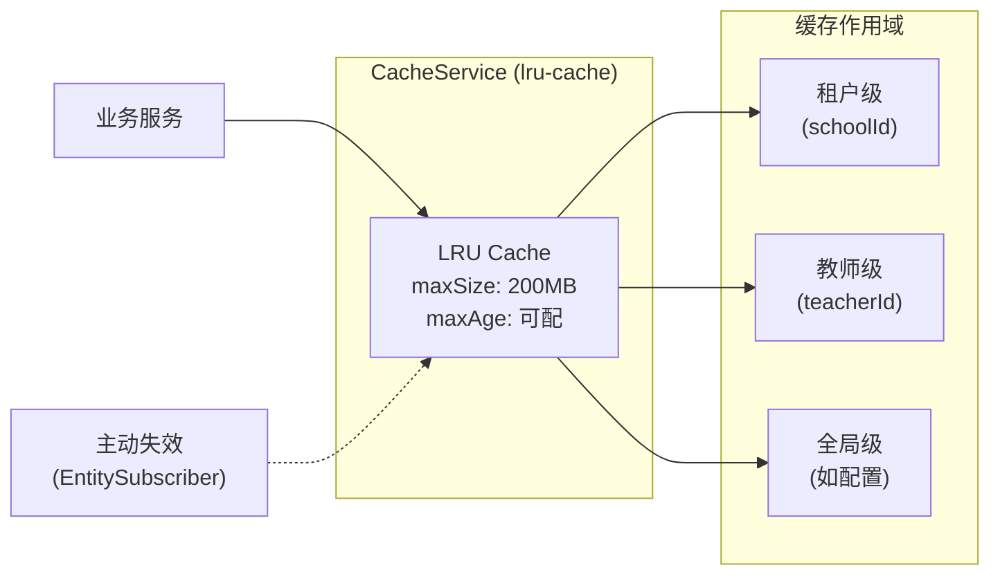

### 2.4 AI 服务架构

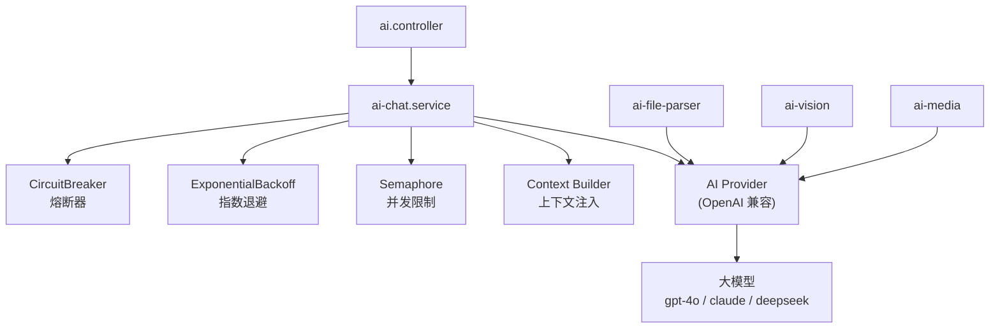

---

## 3. 前端架构 (Vue 3)

### 3.1 应用初始化流程

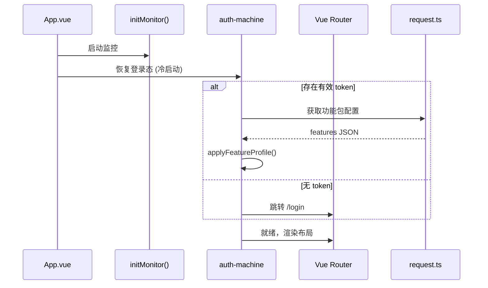

### 3.2 状态管理架构

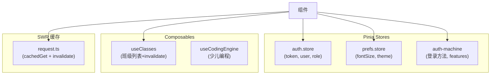

### 3.3 路由守卫流水线

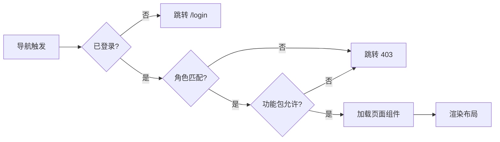

---

## 4. 小程序架构 (uni-app)

### 4.1 分包策略

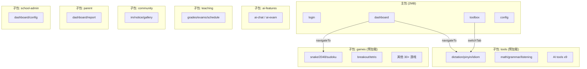

### 4.2 鉴权状态机

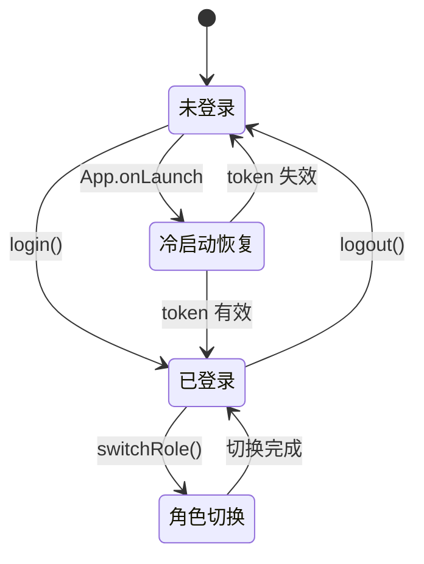

---

## 5. 数据库架构 (TypeORM)

### 5.1 核心实体关系

```mermaid
erDiagram
    SCHOOL ||--o{ TEACHER : has
    SCHOOL ||--o{ STUDENT : has
    SCHOOL ||--o{ CLASS : has
    CLASS ||--o{ STUDENT : contains
    CLASS ||--o{ CLASS_MEMBER : has
    CLASS ||--o{ EXAM : has
    EXAM ||--o{ GRADE : has
    STUDENT ||--o{ GRADE : has_scores_in
    TEACHER ||--o{ CLASS_MEMBER : joins
    TEACHER ||--o{ NOTE : creates
    STUDENT ||--o{ AWARD : receives

    SCHOOL {
        string id PK
        string name
        json features
    }
    TEACHER {
        string id PK
        string name
        string phone
        string schoolId FK
    }
    STUDENT {
        string id PK
        string name
        string classId FK
        string schoolId FK
    }
    CLASS {
        string id PK
        string name
        string teacherId FK
    }
    EXAM {
        string id PK
        string name
        date date
        string classId FK
    }
    GRADE {
        string id PK
        string subject
        json scores
        string examId FK
    }
```

### 5.2 关键表索引策略

| 表 | 索引名 | 列 | 用途 |
|----|--------|-----|------|
| grades | idx_grades_class_date | (classId, date) | 班级成绩查询 |
| grades | idx_grades_exam | (examId) | 考试成绩关联 |
| students | idx_students_class | (classId) | 班级学生列表 |
| exams | idx_exams_class_date | (classId, date) | 考试时间排序 |
| teacher | idx_teacher_school | (schoolId) | 校内教师查询 |

---

## 6. 跨端共享架构 (@gardener/shared)

```
shared/
├── utils/
│   ├── sse-parser.ts        # SSE 流式解析器（两端共用）
│   ├── format.ts            # fmt1/pct/scoreColor 成绩格式化
│   └── security.ts          # isSessionInvalid 会话失效判定
├── schemas/
│   ├── subject-schema.ts     # 学科工具校验
│   └── crud-schema.ts       # CRUD 参数校验
├── constants/
│   ├── subjects.ts           # 学科常量定义
│   └── features.ts           # Feature Flag 键名
├── types/
│   └── *.ts                  # 共享类型定义
└── validators/
    └── *.ts                  # 校验函数
```

### 跨端调用方式

```
三端 tsconfig/vite paths:
@gardener/shared/*  →  shared/src/*

构建时直接编译共享库源码，无需预构建。
```

---

## 7. 关键设计决策记录

### 7.1 为什么用 LRU 替代 Redis？

微信云托管环境下 Redis 需独立实例 + 额外费用。进程内 LRU 满足：
- TTL 过期
- 作用域失效（租户/教师）
- 200MB 上限

代价：多实例缓存不共享、重启丢失。通过主动失效 + DB 兜底缓解。

### 7.2 为什么关闭 DB synchronize？

生产环境禁止 TypeORM 自动建表（避免误删列）。表结构变更通过手动 SQL 迁移 (`server/migrations/*.sql`)。

### 7.3 为什么 AI 上下文注入？

提升 AI 对话质量，让模型了解教师所教班级、学生、近期考试。30s TTL 缓存避免每次对话都查库。

### 7.4 为什么游戏单独分包？

小游戏页面数量大（35+），独立分包避免撑大主包，符合小程序 2MB 主包限制。

---

## 8. 技术债务与演进方向

| 债务 | 影响 | 演进方向 |
|------|------|----------|
| 进程内限流不准 | 多实例下配额翻倍 | 引入 Redis 计数 |
| scores JSON 聚合慢 | 大数据量时统计慢 | 冗余列 + 生成列索引 |
| 上下文缓存失效延迟 | 数据变更后 AI 仍用旧数据 | 事件驱动主动刷新 |
| 小程序单文件过大 | dashboard 1097 行 | 拆分子组件 |
| AI 成本不可控 | 无限流用量 | 增加班级/教师级配额 |

---

*文档版本: v1.0 | 生成日期: 2026-08-19*
