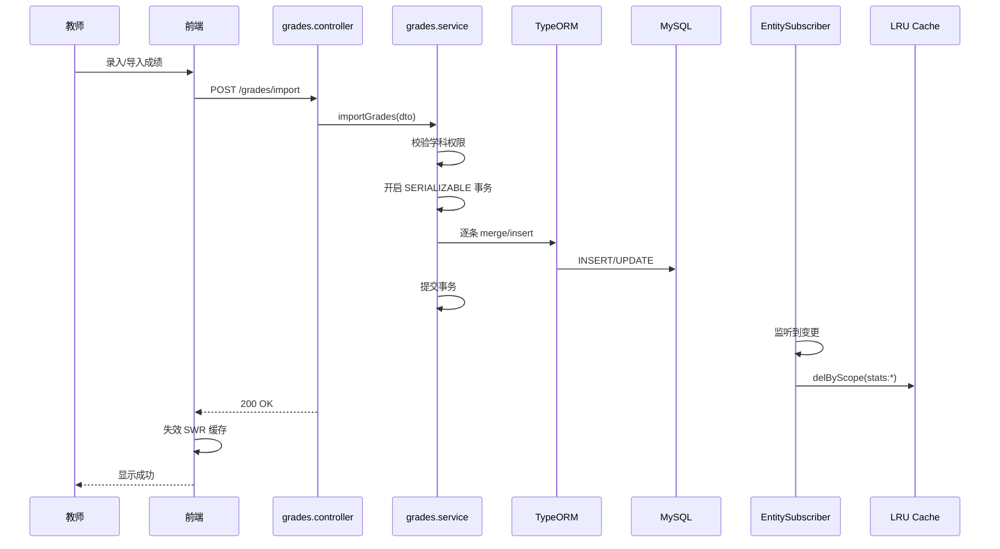
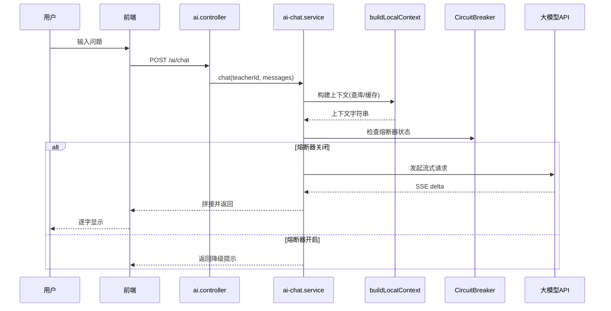

# 园丁工作台 · 系统设计文档

## 1. 设计目标与原则

### 1.1 核心目标

| 目标 | 量化指标 |
|------|----------|
| 高可用 | 月度可用性 > 99.9% |
| 高性能 | API P99 < 500ms，首屏 < 3s |
| 安全合规 | 无高危漏洞，PII 数据加密/脱敏 |
| 可扩展 | 新功能模块可插拔，不影响既有服务 |
| 可维护 | 代码可读、可测试、可追踪 |
| 跨平台 | 三端功能对齐度 > 90% |

### 1.2 设计原则

1. **关注点分离**：Controller 只做参数校验 + DTO 转换；Service 承载业务逻辑；Repository 封装数据访问。
2. **防御式编程**：多层校验（DTO → Guard → 业务层），不信任任何外部输入。
3. **缓存优先**：读多写少场景优先命中 LRU，写操作主动失效关联缓存。
4. **最小权限**：默认拒绝，按需授权；教师只能访问所教班级数据。
5. **优雅降级**：AI 不可用时返回友好提示；网络差时展示缓存旧数据。

---

## 2. 系统分解

### 2.1 服务边界

园丁工作台采用单体 + 模块化设计（非微服务），模块间通过 NestJS 模块机制解耦：

```
NestJS 单体
├── auth.module         → 认证域
├── ai.module           → AI 域
├── grades.module       → 成绩域
├── students.module     → 学生域
├── classes.module      → 班级域
├── exams.module        → 考试域
├── subjects.module     → 学科工具域
├── resource-library.module → 资源库域
├── common.module       → 跨域能力（缓存/CRUD/守卫/异常）
└── feature.module      → Feature Flags 域
```

### 2.2 模块间通信

服务间通过 **依赖注入** 调用，禁止直接 import 实现类。模块通过暴露 `exports` 声明对外能力：

```typescript
// classes.module.ts
@Module({
  providers: [ClassesService, ClassMemberService],
  exports: [ClassesService, ClassMemberService], // 暴露给其他模块
})
export class ClassesModule {}

// grades.module.ts
@Module({
  imports: [ClassesModule], // 引入依赖模块
})
export class GradesModule {}
```

### 2.3 前端模块分解

```
web-app/src/
├── views/              # 页面级组件（按业务域分子目录）
│   ├── teacher/        # 教师工作台
│   ├── school-admin/   # 校管后台
│   ├── super/          # 超管后台
│   ├── parent/         # 家长端
│   ├── tools/          # 学科工具页（43 个）
│   ├── games/          # 游戏页（35+）
│   ├── exams/          # 考试与成绩
│   └── ai/             # AI 中心
├── components/         # 通用组件
├── composables/        # 组合式逻辑复用
├── stores/             # Pinia 状态
├── api/                # HTTP 接口封装
├── router/             # 路由配置
└── utils/              # 工具函数
```

---

## 3. 关键设计模式

### 3.1 CRUD 基类模式

统一的基础增删改查逻辑抽取到 `BaseService` / `BaseController`：

```typescript
// base.service.ts
async findAll(teacherId, classId?, skip?, take?, term?, date?, search?)
async findOne(id)
async create(dto)
async update(id, dto)
async remove(id)      // 软删除
```

Controller 只需继承 + 注入 Repository + 配置路由守卫，5 行代码完成标准 CRUD。

### 3.2 缓存装饰器模式

```typescript
// cache.decorator.ts
@Cacheable({ key: 'teacher-stats', ttl: 30000 })
async getStats(teacherId: string) { ... }

// 缓存命中时直接返回，未命中时执行方法 + 自动写入缓存
```

### 3.3 EntitySubscriber 事件驱动失效

```typescript
// 监听 TypeORM 实体变更事件
@EventSubscriber()
export class GradeSubscriber implements EntitySubscriberInterface<Grade> {
  afterUpdate(event: UpdateEvent<Grade>) {
    // 成绩更新 → 失效相关统计缓存
    cacheService.delByScope(`stats:${event.entity.schoolId}`)
  }
}
```

### 3.4 Facade 模式 (AI 服务)

AI 相关能力较多（聊天/文件解析/视觉/媒体），通过 Facade 服务整合：

```
ai.controller.ts → ai-chat.service.ts (聊天/上下文/熔断)
              → ai.service.ts (考试分析/知识点/教案)
              → ai-file-parser.service.ts (文档解析)
              → ai-vision.service.ts (视觉理解)
              → ai-media.service.ts (图片/音频生成)
```

### 3.5 策略模式 (AI Provider)

多模型动态切换：

```typescript
interface IAiProvider {
  chat(messages): Promise<string>
  streamChat(messages, onDelta): Promise<void>
  getModel(): string
}

class OpenAIProvider implements IAiProvider { ... }
class ClaudeProvider implements IAiProvider { ... }
class DeepSeekProvider implements IAiProvider { ... }
```

通过 `ai_providers` 表配置决定使用哪个 Provider，运行时动态选择。

### 3.6 状态机模式 (鉴权)

前端鉴权使用 XState 风格状态机：

```
未登录 → 已登录(教师) → 功能包可用
                          ↓
                      角色切换 → 已登录(校管)
```

---

## 4. 数据流设计

### 4.1 成绩录入流程



### 4.2 AI 对话流程



---

## 5. 接口设计

### 5.1 RESTful API 规范

| 方法 | 路径 | 说明 |
|------|------|------|
| GET | `/api/v1/:resource` | 列表（分页 + 搜索） |
| GET | `/api/v1/:resource/:id` | 详情 |
| POST | `/api/v1/:resource` | 创建 |
| PATCH | `/api/v1/:resource/:id` | 部分更新 |
| DELETE | `/api/v1/:resource/:id` | 软删除 |

### 5.2 统一响应格式

```typescript
// 成功
{ "data": [...], "total": 100 }

// 分页
{ "items": [...], "total": 100, "skip": 0, "take": 20 }

// 错误
{ "statusCode": 400, "message": "参数错误", "error": "Bad Request" }
```

### 5.3 核心 API 清单

```
认证:
  POST /auth/wechat-login        # 微信小程序登录
  POST /auth/unified-login       # Web 统一登录
  POST /auth/refresh             # 刷新 token
  POST /auth/change-password     # 修改密码

学生:
  GET  /students?classId=&skip=&take=
  POST /students
  PATCH /students/:id
  DELETE /students/:id

成绩:
  GET  /grades?classId=&examId=
  POST /grades/import            # 批量导入
  POST /grades/ai-import         # AI 识导入
  GET  /grades/stats/:classId    # 班级统计

考试:
  GET  /exams?classId=
  POST /exams
  GET  /exams/:id

AI:
  POST /ai/chat                  # AI 对话（流式）
  POST /ai/exam-analysis         # 考试分析
  POST /ai/lesson                # 智能教案
  POST /ai/knowledge             # 知识点生成
  POST /ai/paper                 # 试卷组卷

班级:
  GET  /classes                  # 教师的班级列表
  POST /classes
  GET  /classes/:id/members      # 班级成员
```

---

## 6. 错误处理设计

### 6.1 分层错误策略

| 层次 | 错误类型 | 处理方式 |
|------|----------|----------|
| Controller | DTO 校验失败 | class-validator 自动 400 |
| Guard | 未登录 / 越权 | JwtAuthGuard 401 / RolesGuard 403 |
| Service | 业务异常 | BusinessException (自定义状态码) |
| Repository | DB 约束冲突 | TypeORM 异常 → 业务异常转换 |
| 全局兜底 | 未预期异常 | AllExceptionsFilter → 500 + 日志 |

### 6.2 业务异常码

```typescript
// business.exception.ts
enum ErrorCode {
  FORBIDDEN = 40301,           // 无权访问
  EXAM_NOT_FOUND = 40401,      // 考试不存在
  SUBJECT_MISMATCH = 40001,    // 学科不匹配
  AI_SERVICE_ERROR = 50001,    // AI 服务异常
  AI_QUOTA_EXCEEDED = 42901,   // AI 配额用尽
}
```

### 6.3 AI 错误分类

```typescript
enum AiErrorType {
  NETWORK = 'NETWORK',     // 网络超时 → 可重试
  AUTH = 'AUTH',           // API Key 无效 → 不重试
  QUOTA = 'QUOTA',         // 配额用尽 → 30s 后重试
  RATE_LIMIT = 'RATE_LIMIT', // 限流 → 指数退避
  UNKNOWN = 'UNKNOWN',     // 未知 → 重试 1 次
}
```

---

## 7. Feature Flags 设计

### 7.1 配置存储

```sql
-- schools 表
features JSON NOT NULL DEFAULT (JSON_OBJECT())

-- 示例
{"ai_chat": true, "ai_exam_analysis": true, "five_edu": false}
```

### 7.2 解析流程

```typescript
// school-level.resolver.ts
resolve(teacher: Teacher, feature: string): boolean {
  const school = await this.schoolRepo.findOne(teacher.schoolId)
  return school?.features?.[feature] === true
}
```

### 7.3 Guard 使用

```typescript
@UseGuards(FeatureGuard)
@Feature('ai_chat')  // 声明需要的功能包
@Post('chat')
async chat() { ... }
```

---

## 8. 部署设计

### 8.1 微信云托管配置

```yaml
# 服务配置
service:
  name: gardener-server
  resources:
    cpu: 2
    memory: 4Gi
  minInstances: 1
    maxInstances: 5
  env:
    DB_HOST: ${env.DB_HOST}
    DB_PASSWORD: ${env.DB_PASSWORD}
    ENCRYPTION_KEY: ${env.ENCRYPTION_KEY}
```

### 8.2 数据库连接池

```typescript
// app.module.ts
TypeOrmModule.forRoot({
  type: 'mysql',
  host: process.env.DB_HOST,
  username: process.env.DB_USER,
  password: process.env.DB_PASSWORD,
  database: process.env.DB_NAME,
  poolSize: 20,
  retryAttempts: 3,
  connectTimeout: 5000,
  synchronize: false,  // 禁止自动建表
})
```

### 8.3 静态资源托管

```
Vite build → dist/ → 微信云托管静态托管
入口: dist/index.html
SPA fallback: 所有路由 → index.html
```

---

## 9. 性能设计

### 9.1 缓存策略矩阵

| 数据类型 | 缓存位置 | TTL | 失效方式 |
|----------|----------|-----|----------|
| AI 对话上下文 | LRU | 30s | 定时过期 |
| 班级列表 SWR | 前端内存 | 30s | mutation 后主动失效 |
| 成绩统计 | LRU | 60s | EntitySubscriber 主动失效 |
| 功能包配置 | LRU | 300s | 定时过期 |
| 学科工具配置 | LRU | 600s | 定时过期 |

### 9.2 数据库优化

- 读写分离：当前单库，未来可加只读副本
- 慢查询监控：> 1s 自动记录
- N+1 规避：使用 QueryBuilder join 或批量 IN 查询
- 分页保护：take 上限 500，超出截断

### 9.3 前端性能

- 路由懒加载：`() => import('./views/...')`
- 组件按需引入：ECharts 按需引入 + 图表策略文档
- 预加载：hover 预加载 + requestIdleCallback 空闲预加载

---

## 10. 安全设计

### 10.1 JWT 策略

```typescript
// access token: 2h, refresh token: 30d
// refresh token 存储 HttpOnly cookie（Web）/ 本地存储（小程序）
```

### 10.2 多层权限校验

```
请求 → JWT Guard (鉴权) → Roles Guard (角色) → Feature Guard (功能包) → 业务级校验 (teacherId 过滤)
```

### 10.3 敏感数据保护

- 密码：bcrypt 哈希（cost factor 12）
- 手机号：API 响应自动 mask（`138****1234`）
- 身份证：加密存储（AES-256，ENCRYPTION_KEY 环境变量）
- 日志：不打印 token、密码、完整手机号

---

*文档版本: v1.0 | 生成日期: 2026-08-19*
