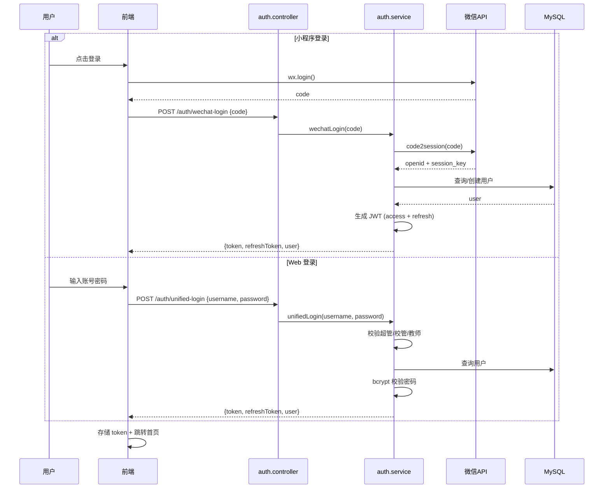

# 园丁工作台 · 系统详细设计文档

## 1. 认证模块详细设计

### 1.1 登录流程



### 1.2 JWT 结构

```typescript
// Access Token Payload
{
  sub: "teacher-uuid",      // 用户 ID
  role: "teacher",          // 角色
  schoolId: "school-uuid",  // 学校 ID
  aud: "gardener-web",      // 受众
  iat: 1700000000,          // 签发时间
  exp: 1700007200           // 过期时间 (2h)
}

// Refresh Token Payload
{
  sub: "teacher-uuid",
  type: "refresh",
  iat: 1700000000,
  exp: 1702592000           // 30 天
}
```

### 1.3 密码升级策略

```typescript
// 透明升级：旧 sha256 → bcrypt
async validatePassword(user, input) {
  if (user.password.startsWith('$2b$')) {
    // 已是 bcrypt
    return bcrypt.compare(input, user.password)
  } else {
    // 旧 sha256，验证成功后升级
    const valid = sha256(input) === user.password
    if (valid) {
      user.password = await bcrypt.hash(input, 12)
      await this.userRepo.save(user)
    }
    return valid
  }
}
```

---

## 2. AI 模块详细设计

### 2.1 上下文注入 (buildLocalContext)

每次 AI 对话前，系统注入教师本地数据作为上下文：

```typescript
private async buildLocalContext(ownerType, ownerId): Promise<string> {
  // 缓存命中直接返回
  const cacheKey = `ai-context:${teacherId}`
  const cached = this.cache.get<string>(cacheKey)
  if (cached !== undefined) return cached

  // 信号量限流：最多 3 路并发查库
  const sem = new Semaphore(3)
  const [u, classes, students, teachers, grades, exams, awards, notes] =
    await Promise.all([
      safeQuery(this.userRepo.findOne({ where: { id: teacherId } })),
      safeQuery(this.classRepo.find({ where: { teacherId }, take: 20 })),
      // ... 其他查询
    ])

  // 拼接上下文
  const lines = ['—— 已注入教师本地数据 ——']
  if (classes.length) lines.push(`所教班级: ${classes.map(c => c.name).join(', ')}`)
  if (grades.length) lines.push(`近期成绩: ...`)
  // ...

  const context = lines.join('\n')
  this.cache.set(cacheKey, context, { ttl: 30000 }) // 30s TTL
  return context
}
```

### 2.2 熔断器实现

```typescript
class CircuitBreaker {
  private failures = 0
  private state: 'CLOSED' | 'OPEN' | 'HALF_OPEN' = 'CLOSED'
  private openedAt = 0

  async execute<T>(fn: () => Promise<T>): Promise<T> {
    if (this.state === 'OPEN') {
      if (Date.now() - this.openedAt > this.resetMs) {
        this.state = 'HALF_OPEN'  // 半开：允许一次探测
      } else {
        throw new Error('AI 服务熔断中，请稍后重试')
      }
    }
    try {
      const r = await fn()
      this.failures = 0
      this.state = 'CLOSED'
      return r
    } catch (e) {
      this.failures++
      if (this.failures >= this.threshold) {
        this.state = 'OPEN'
        this.openedAt = Date.now()
      }
      throw e
    }
  }
}
```

### 2.3 SSE 流式解析

```typescript
// SSE 协议解析器 (@gardener/shared/utils/sse-parser.ts)
export function createSSEParser() {
  let buffer = ''
  return function onChunk(chunk: string, onDelta: (text: string) => void) {
    buffer += chunk
    const lines = buffer.split('\n')
    buffer = lines.pop() || ''  // 保留不完整的行

    for (const line of lines) {
      if (line.startsWith('data: ')) {
        const data = line.slice(6)
        if (data === '[DONE]') return
        try {
          const json = JSON.parse(data)
          const delta = json.choices?.[0]?.delta?.content
          if (delta) onDelta(delta)
        } catch { /* ignore parse error */ }
      }
    }
  }
}
```

### 2.4 背压控制

```typescript
// 当 onDelta 返回 false 时，暂停上游读取
async streamChat(payload, onDelta) {
  const parser = createSSEParser()
  const response = await fetch(url, { method: 'POST', body: JSON.stringify(payload) })
  const reader = response.body.getReader()

  while (true) {
    const { done, value } = await reader.read()
    if (done) break
    const shouldContinue = onDelta(parser(value))
    if (shouldContinue === false) {
      await reader.cancel()  // 背压：暂停上游
      break
    }
  }
}
```

---

## 3. 成绩模块详细设计

### 3.1 成绩数据结构

```typescript
// Grade 实体
@Entity('grades')
export class Grade extends BaseEntity {
  @Column({ type: 'varchar', length: 64 })
  examId: string

  @Column({ type: 'varchar', length: 64 })
  classId: string

  @Column({ type: 'varchar', length: 32 })
  subject: string

  // scores JSON 结构: [{ studentId, score, studentName }]
  @Column({ type: 'simple-json', default: '[]' })
  scores: Array<{ studentId: string; score: number; studentName?: string }>
}
```

### 3.2 成绩统计查询

```typescript
// 使用 MySQL JSON_TABLE 在 DB 层聚合
async computeClassStats(classId: string, examId: string) {
  const rows = await this.repo.query(
    `SELECT
       COUNT(js.score) AS count,
       AVG(js.score) AS avg,
       MAX(js.score) AS max,
       MAX(CASE WHEN js.score >= 60 THEN js.score END) AS passScore
     FROM grades g,
          JSON_TABLE(g.scores, '$[*]' COLUMNS (
            score DECIMAL(6,2) PATH '$.score'
          )) js
     WHERE g.class_id = ? AND g.exam_id = ?`,
    [classId, examId]
  )
  return rows[0]
}
```

### 3.3 成绩导入事务

```typescript
async importGrades(teacherId, dto) {
  await this.assertSubjectPermission(teacherId, dto.classId, dto.subject)

  // SERIALIZABLE 隔离级别防止并发覆盖
  return await this.dataSource.transaction('SERIALIZABLE', async (manager) => {
    for (const row of dto.rows) {
      const existing = await manager.findOne(Grade, {
        where: { classId: dto.classId, examId: dto.examId, subject: dto.subject }
      })
      if (existing) {
        // 合并 scores
        existing.scores = this.mergeScores(existing.scores, row.scores)
        await manager.save(existing)
      } else {
        await manager.save(Grade, { ...row, classId: dto.classId, examId: dto.examId })
      }
    }
  })
}
```

---

## 4. 缓存模块详细设计

### 4.1 CacheService 接口

```typescript
@Injectable()
export class CacheService {
  private cache: LRUCache<string, any>

  get<T>(key: string): T | undefined
  set(key: string, value: any, options?: { ttl?: number; scope?: string }): void
  del(key: string): void
  delByScope(scope: string): void    // 按作用域失效
  delByTenant(tenantId: string): void // 按租户失效
  getStats(): { hits: number; misses: number; size: number }
}
```

### 4.2 缓存作用域映射

```typescript
// request.ts
const scopeMap = new Map<string, string[]>()
// 例: '/students' → ['tenant:school-001', 'teacher:teacher-001']

export function registerCacheScope(path: string, scopes: string[]) {
  scopeMap.set(path, scopes)
}

export function invalidateCache(relatedPath?: string) {
  if (!relatedPath) { swrCache.clear(); return }
  for (const [key] of swrCache) {
    if (key.includes(relatedPath)) swrCache.delete(key)
  }
}
```

### 4.3 LRU 配置

```typescript
// cache.module.ts
export const cacheProviders = [
  {
    provide: CacheService,
    useFactory: () => new CacheService({
      max: 5000,                // 最大条目数
      maxSize: 200 * 1024 * 1024, // 200MB
      ttl: 1000 * 60 * 5,       // 默认 5 分钟
      updateAgeOnGet: true,     // 访问后刷新 TTL
      sizeCalculation: (val) => JSON.stringify(val).length,
    })
  }
]
```

---

## 5. 前端状态管理详细设计

### 5.1 auth-machine 状态机

```typescript
// 状态定义
type AuthState = 'unauthenticated' | 'authenticating' | 'authenticated' | 'error'

// 事件
type AuthEvent =
  | { type: 'LOGIN'; role: Role; token: string }
  | { type: 'LOGOUT' }
  | { type: 'REFRESH'; token: string }
  | { type: 'ERROR'; error: Error }

// 上下文
interface AuthContext {
  user: User | null
  role: Role | null
  features: Record<string, boolean>
  error: Error | null
}
```

### 5.2 SWR 缓存实现

```typescript
// request.ts
const swrCache = new Map<string, { data: any; expireAt: number }>()
const SWR_MAX_SIZE = 200

export function cachedGet<T>(url: string, ttl = 30000): Promise<T> {
  const cacheKey = `GET:${url}`
  const cached = swrCache.get(cacheKey)

  // 新鲜命中
  if (cached && cached.expireAt > Date.now()) {
    return Promise.resolve(cached.data)
  }

  // 请求 + LRU 淘汰
  return get<T>(url).then(data => {
    if (swrCache.size >= SWR_MAX_SIZE) {
      const oldestKey = swrCache.keys().next().value
      if (oldestKey) swrCache.delete(oldestKey)
    }
    swrCache.set(cacheKey, { data, expireAt: Date.now() + ttl })
    return data
  })
}
```

### 5.3 请求竞态防护

```typescript
// AbortController 取消旧请求
const pendingControllers = new Map<string, AbortController>()

export async function get<T>(url: string, params?: any): Promise<T> {
  const key = `${url}:${JSON.stringify(params)}`
  if (pendingControllers.has(key)) {
    pendingControllers.get(key)!.abort()  // 取消旧请求
  }
  const controller = new AbortController()
  pendingControllers.set(key, controller)

  try {
    const res = await instance.get(url, { params, signal: controller.signal })
    pendingControllers.delete(key)
    return res.data
  } catch (e) {
    pendingControllers.delete(key)
    throw e
  }
}
```

---

## 6. 小程序分包详细设计

### 6.1 pages.json 配置

```json
{
  "pages": [
    { "path": "pages/login/login" },
    { "path": "pages/dashboard/dashboard" },
    { "path": "pages/toolbox/toolbox" }
  ],
  "subPackages": [
    {
      "root": "pages/games",
      "pages": ["snake", "2048", "sudoku", "..."]
    },
    {
      "root": "pages/tools",
      "pages": ["dictation", "pinyin", "idiom", "..."]
    },
    {
      "root": "pages/ai",
      "pages": ["ai-chat", "ai-exam", "..."]
    }
  ],
  "preloadRule": {
    "pages/dashboard/dashboard": {
      "network": "all",
      "packages": ["pages/tools", "pages/ai-features"]
    }
  }
}
```

### 6.2 请求封装

```javascript
// common/request.js
export function request(options) {
  return new Promise((resolve, reject) => {
    const token = readToken()
    uni.request({
      url: API_PREFIX + options.url,
      method: options.method || 'GET',
      data: options.data,
      header: {
        'Authorization': `Bearer ${token}`,
        'X-Request-Id': generateUUID(),
      },
      success: (res) => {
        if (res.statusCode === 401) {
          if (isSessionInvalid(res.data)) {
            emitAuthReset()  // 触发重新登录
          }
        }
        resolve(res.data)
      },
      fail: reject,
    })
  })
}
```

### 6.3 鉴权状态机

```javascript
// common/auth-machine.js
export const auth = reactive({
  token: '',
  user: null,
  role: '',
  features: {},
})

export function login(role, token, user) {
  auth.token = token
  auth.user = user
  auth.role = role
  uni.setStorageSync(TOKEN_KEY, token)
}

export function logout() {
  auth.token = ''
  auth.user = null
  auth.role = ''
  clearAuthStorage()
}
```

---

## 7. 跨端共享模块详细设计

### 7.1 SSE 解析器 (两端共用)

```typescript
// shared/utils/sse-parser.ts
export function createSSEParser() {
  let buffer = ''
  return function parse(chunk: string, onDelta: (text: string) => boolean | void) {
    buffer += chunk
    const lines = buffer.split('\n')
    buffer = lines.pop() || ''

    for (const line of lines) {
      if (!line.startsWith('data: ')) continue
      const data = line.slice(6).trim()
      if (data === '[DONE]') return false
      try {
        const json = JSON.parse(data)
        const delta = json.choices?.[0]?.delta?.content
        if (delta) {
          const shouldContinue = onDelta(delta)
          if (shouldContinue === false) return false
        }
      } catch { /* ignore */ }
    }
    return true
  }
}
```

### 7.2 学科工具校验

```typescript
// shared/schemas/subject-schema.ts
export const SUBJECT_TOOLS = {
  chinese: ['dictation', 'pinyin', 'idiom', 'poetry', 'reading', 'essay'],
  math: ['calc', 'mathGen', 'multiplicationTable', 'unitConversion', 'verticalCalc'],
  english: ['wordCard', 'spell', 'grammar', 'listening', 'speaking', 'sceneDialogue'],
  common: ['randomPicker', 'randomGrouper', 'seatMap', 'classDuty', 'timer'],
}

export function getSubjectTool(subject: string): string[] {
  return [...(SUBJECT_TOOLS[subject] || []), ...SUBJECT_TOOLS.common]
}
```

### 7.3 会话失效判定

```typescript
// shared/utils/security.ts
const SESSION_INVALID_PATTERNS = [
  /登录已过期/,
  /token.*无效/,
  /会话.*失效/,
  /Unauthorized/i,
]

export function isSessionInvalid(response: any): boolean {
  const msg = response?.message || response?.error || ''
  return SESSION_INVALID_PATTERNS.some(p => p.test(msg))
}
```

---

## 8. 监控与告警详细设计

### 8.1 前端监控 (monitor.ts)

```typescript
export function initMonitor() {
  // Core Web Vitals
  new PerformanceObserver((list) => {
    for (const entry of list.getEntries()) {
      if (entry.entryType === 'lcp') reportLCP(entry)
      if (entry.entryType === 'fid') reportFID(entry)
      if (entry.entryType === 'cls') reportCLS(entry)
    }
  }).observe({ type: 'web-vitals' })

  // 全局错误
  window.addEventListener('error', (e) => {
    reportMonitor({ type: 'error', message: e.message, stack: e.error?.stack })
  })
  window.addEventListener('unhandledrejection', (e) => {
    reportMonitor({ type: 'promise', message: String(e.reason) })
  })
}

export function reportMonitor(entry: MonitorEntry) {
  navigator.sendBeacon?.('/api/v1/monitor', JSON.stringify(entry))
  // 失败时写入 localStorage 重试
}
```

### 8.2 后端日志

```typescript
// 请求追踪 ID
@Injectable()
export class TraceMiddleware implements NestMiddleware {
  use(req: Request, res: Response, next: NextFunction) {
    const traceId = req.headers['x-request-id'] || uuidv4()
    req['traceId'] = traceId
    res.setHeader('X-Request-Id', traceId)
    Logger.log(`[${traceId}] ${req.method} ${req.url}`)
    next()
  }
}
```

---

## 9. 数据库迁移管理

### 9.1 迁移文件命名规范

```
server/migrations/
├── 0001_init_schema.sql
├── 0002_add_grade_indexes.sql
├── 0003_add_ai_tables.sql
├── 0004_add_school_features.sql
├── 0045_monitor_school_id.sql
└── ...
```

### 9.2 迁移执行

```bash
# 手动执行迁移
mysql -h <host> -u <user> -p <database> < server/migrations/0045_monitor_school_id.sql

# 或使用迁移 runner
npm run migrate
```

### 9.3 迁移记录表

```sql
CREATE TABLE IF NOT EXISTS migrations (
  id INT AUTO_INCREMENT PRIMARY KEY,
  name VARCHAR(255) NOT NULL UNIQUE,
  executed_at TIMESTAMP DEFAULT CURRENT_TIMESTAMP
);
```

---

## 10. 测试策略

### 10.1 测试金字塔

```
        /  E2E  \          ← 关键流程（登录→操作→验证）
       /________\
      / Integration \     ← API 集成测试（Supertest）
     /______________\
    /    Unit Tests   \   ← Service / Util 单测（Jest）
   /____________________\
```

### 10.2 关键测试用例

| 模块 | 测试项 | 工具 |
|------|--------|------|
| auth | 登录/鉴权/越权 | Jest + Supertest |
| grades | 成绩导入/统计/软删除 | Jest |
| ai | 熔断/重试/上下文注入 | Jest (mock) |
| cache | LRU 淘汰/作用域失效 | Jest |
| frontend | 组件渲染/交互 | Vue Test Utils |
| mini-program | 页面跳转/接口 | minium |

---

*文档版本: v1.0 | 生成日期: 2026-08-19*
